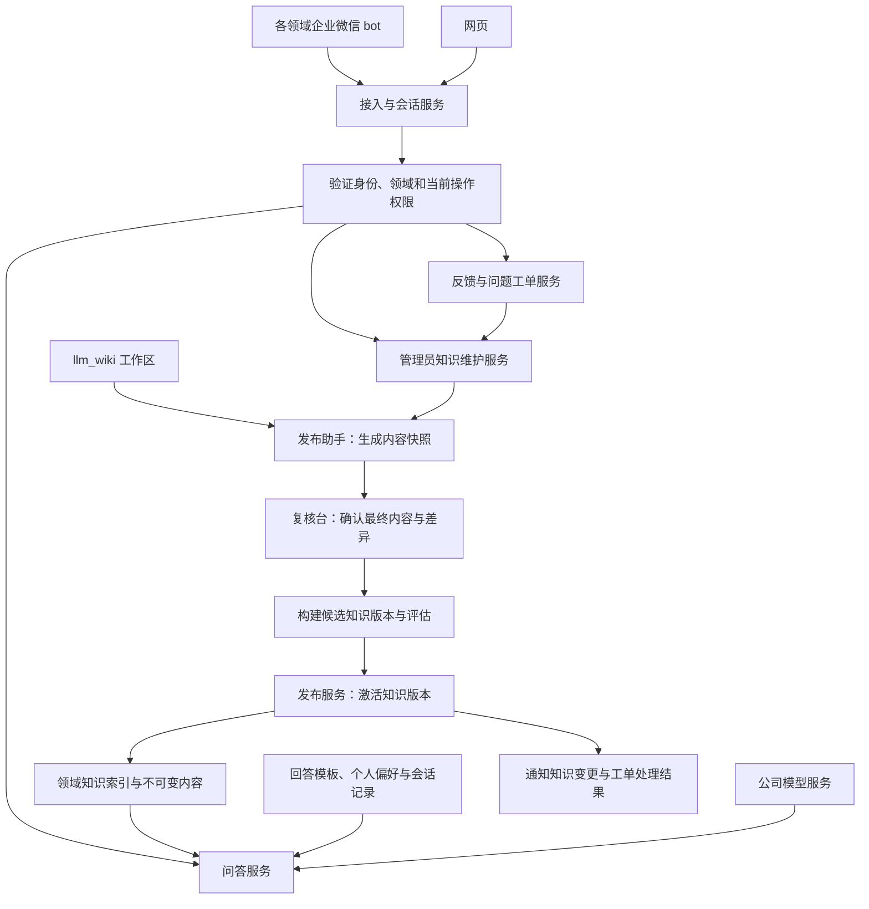

# 基于 Pi 与 llm_wiki 的通用领域知识 Bot：首版设计

> 历史需求修订记录（2026-09-25）。当前规范性设计见 [完整设计 v0.4](domain-knowledge-bot-design-v0.4.md)；下文保留当时的设计与待办状态。

版本：v0.3（人群、权限与问题登记需求修订稿）\
日期：2026-09-25\
状态：本地设计提案，尚未实现或完成上线验证。本稿补充不同人群的回答风格、按角色开放能力、反馈及独立问题登记、管理员通过 bot 发起知识更新。

基线：[OptionsRight/wikiBot v0.2，提交 3f847e0](https://github.com/OptionsRight/wikiBot/blob/3f847e074b533c863af7970a03624434e8cef640/docs/handoff/domain-knowledge-bot-design-v0.2.md)。本稿替换其中涉及角色、反馈和维护入口的规定；模型 SDK 暂沿用基线候选方案，本次需求不要求追加 Agent 框架。独立审查提出的 3 项 P1、2 项 P2 仍按第 10 节跟踪，不能沿用旧稿“无遗留 P1”的结论。审查原文见[实施前设计审查](../../reviews/wikiBot-design-review-2026-09-25/REVIEW.md)。

## 1. 目标与已经确认的范围

建设一套通用知识问答框架，各业务领域复用 nashsu/llm_wiki 管理知识，通过统一发布入口接入。每个领域使用独立企业微信 bot，共用后台服务；网页支持问答、查看引用、反馈、问题登记与跟踪，以及管理员的知识修订和发布。企微 bot 按用户权限提供相应入口，复用同一套业务接口。

首个领域为广告，试点覆盖新渠道接入、腾讯广告新增代理商、腾讯 RTA 新增策略。新增代理商已确认是固定流程；其余流程的分支需要在整理知识时确认。用户需要完成准备和配置，首版只提供指导，不读取广告系统实际状态、不执行配置。

已确认要求：

| 项目 | 首版决定 |
|---|---|
| 模型与框架 | 使用公司批准的模型服务；暂沿用 v0.2 的 Pi SDK 候选方案，通过 ModelGateway 隔离；不使用 Dify |
| 领域接入 | 统一复用 nashsu/llm_wiki；不做通用网站爬虫或其他 Wiki 连接器 |
| 人群与回答风格 | 首版提供业务视角、技术视角，支持入门/熟练等解释深度；领域可配置模板 |
| 操作权限 | 首版为领域普通成员、领域知识管理员；普通成员可问答、反馈和登记问题，管理员增加知识维护与工单处理能力 |
| 知识可见范围 | 拥有同领域知识访问资格的成员查询同一套已发布知识；草稿、工单和私人会话另行检查访问范围 |
| 记忆 | 个人偏好长期保存，保留当前会话上下文；不做任务进度记忆 |
| 反馈与问题登记 | 既能针对答案反馈，也能直接登记未解决的问题；统一工单跟踪，知识修订和发布独立记录 |
| 性能 | 普通知识问答至少 95% 在 3 秒内开始输出有用内容，10 秒内完成 |
| 成功标准 | 业务能够自行完成操作为主要目标；减少专家答疑与知识持续改善为辅助指标 |

首版不做跨领域联合回答、自动学习所有历史聊天、实际业务任务执行与进度管理、多 Agent 协商、自主联网补充业务事实或模型微调。问题工单只跟踪答疑与知识改进，不记忆或推进客户开户、广告配置等实际业务任务。领域访问资格、回答风格、操作权限分别建模，不能由其中一项推导另外两项。

## 2. 总体结构与责任边界



图中的授权节点表达所有业务操作必须经过的检查；各 API、工具执行与异步作业仍须分别执行检查，不能仅在登录或入口检查一次。

| 模块 | 负责 | 不负责 |
|---|---|---|
| llm_wiki | 原资料整理、知识编写与维护 | 在线多人问答的可用性、平台发布授权 |
| 发布助手与发布服务 | 快照、复核、索引、评估、激活、撤回 | 在未经确认时生成新的业务规则 |
| 知识服务 | 按领域和版本检索、读取完整流程、提供引用 | 用户身份选择、答案表达 |
| Pi 问答服务 | 组织上下文、调用模型、受限工具执行、流式回答 | 决定谁有发布权限 |
| 业务服务 | 身份、领域角色、会话、回答风格、偏好、审计 | 根据用户自称或模型输出授予权限 |
| 工单服务 | 答案反馈、问题登记、补材料、处理进度和解决确认 | 将工单关闭等同于用户业务操作已完成 |
| 知识维护服务 | 管理员修订草稿、来源写回、复核与发布申请 | 将模型生成的草稿直接变成线上知识 |
| 企微与网页适配器 | 消息收发、展示和交互 | 各自维护另一份知识或记忆 |

建议工程形态为 TypeScript 模块化服务，按部署需要拆分入口进程和异步 worker；首版不拆成大量微服务。持久化数据放关系数据库，不可变知识内容放公司对象存储或受控文件存储。消息、反馈、发布和通知使用数据库任务表/outbox，可重试并保证幂等。

## 3. “提供 Wiki 地址即可接入”的实际契约

### 3.1 地址是什么

接入地址定义为本框架的“已发布知识入口”，例如 `https://knowledge.internal/domains/ads/manifest.json`，不是工作人员电脑上的 localhost API，也不是任意 Wiki 网页。示例域名与下文接口均为拟议设计。

llm_wiki 当前的 MCP 服务转发本地桌面 API，要求桌面应用运行，因此线上请求不依赖该桌面进程。[S1]

第一次建立平台时开发一个发布助手，在能读取 llm_wiki 工作区的位置运行（维护者机器或公司服务器）。它读取选定页面、生成内容快照并提交到发布台。复核发布后，生成稳定知识入口地址。后续 bot 管理员填入此地址，平台读取描述信息，查找并绑定此前已创建的领域实例，不重复创建领域。

“只填地址”覆盖知识接入体验；企微 bot 凭据、公司模型连接、身份目录与首位负责人属于一次性开通配置。不能从地址自动推断密钥和授权。平台提供默认业务/技术回答模板，知识管理员可预览并配置领域称谓；模板调整按配置版本发布。领域开通、bot 凭据管理和权限授予使用平台配置权限，不因获得某领域的知识管理权限自动开放。

### 3.2 新增领域的步骤

1. 有平台配置权限的人员先创建 pending 领域，指定知识管理员、访问范围，并签发仅属于该领域的发布助手凭据。
2. 领域维护者配对一个受控 llm_wiki 工作区，手动提交页面快照、来源关系和候选变更，负责人在网页复核。
3. 构建候选索引并运行该领域评估，生成受平台信任的发布记录与稳定入口地址。
4. bot 管理员登记该地址，平台解析出已经创建的领域，并绑定企业微信 bot；复用入口时无需再次导入原始资料。
5. 用该领域试题验收后启用。后续内容更新走同一发布链路，不修改框架代码。

首版助手由领域维护者手动运行，一次只绑定一个工作区；不要求自动常驻扫描。后台展示最后提交、最后发布与待处理状态，助手离线不影响已经发布的在线知识。平台无法凭空知道离线工作区的改动，不能把“线上仍可用”显示成“与本地始终最新”；变更生效前发布仍由指定负责人落实。

### 3.3 发布格式

在 llm_wiki 原有文件之外，助手生成平台自己的 manifest 和领域配置，不假定这些字段为 llm_wiki 原生功能：

```json
{
  "schema_version": "1",
  "domain_id": "ads",
  "release_id": "ads-r0001",
  "parent_release_id": null,
  "published_at": "2026-09-25T08:00:00Z",
  "pages": [
    {
      "id": "tencent-agency-onboarding",
      "path": "procedures/tencent-agency.md",
      "sha256": "<content-hash>",
      "kind": "procedure",
      "title": "腾讯广告新增代理商",
      "source_refs": ["sources/agency-guide#section-2"],
      "links": ["terms/advertiser-account"]
    }
  ]
}
```

发布服务根据实际审核记录生成 manifest；不信任源文件自称 `approved: true`。每页内容哈希绑定复核记录，审核后再修改文件必须重新复核。稳定文档 ID 保持引用可追溯，改名不改变 ID；删除和替换通过新版本体现。

流程页需要：适用范围、前置条件、准备材料、完整步骤、协作岗位、验收标准、常见问题、负责人、复核时间。缺失关键流程字段时阻止该页作为流程指南发布；普通概念页采用较轻模板。

只发布审核通过的页面与被允许引用的来源摘录；原始材料不是默认全部上线。链接闭包检查确保回答需要的步骤、术语及来源能在同一发布版本中读取。llm_wiki 自动生成的摘要、评论或待复核草稿不能绕过这条边界。

助手首版协议固定如下，作为实现与第二领域接入验收的契约：

| 项目 | 首版支持及处理 |
|---|---|
| 内容 | UTF-8 Markdown、常见标题/列表/表格/代码块；读取 YAML frontmatter，保留原字段但不执行其指令 |
| 内部链接 | Markdown 相对链接、`[[path]]`、`[[path#anchor\|label]]`；解析到规范路径与稳定 ID，歧义、越界路径和必要死链阻止发布 |
| 稳定 ID | 发布助手维护独立映射清单；改名需声明旧 ID 的新路径，不能仅靠标题或相似度猜测 |
| 来源 | 提交被选中的文本摘录、原来源路径/标识和内容哈希；源材料未获准公开时只展示可公开引用说明，不下发原件 |
| 附件 | 仅发布人工选定的静态图片等白名单资源，携带媒体类型、大小与哈希；未知附件报错，不在问答时临时解析远程 Office/PDF |
| 快照包 | 页面、来源摘录、附件及 ID 映射形成完整清单；服务端逐项校验哈希与所属领域，上传完成才创建候选版本 |
| 提交与重复 | `submission_id + bundle_hash` 幂等；中断上传可以重试，缺文件或内容变化的包不进入复核 |
| 写回 | 首版输出修订包，由维护者在停止编辑/导入的维护窗口应用；无法保证单写者时仅供人工合并，再重新快照 |

配置、来源映射及附件清单均存放在助手专用目录或平台记录中，不要求修改 llm_wiki 内部数据库。阶段 0 须交付实际小工作区的安装、导出、改名、引用、纠错和再次导出操作说明。

### 3.4 索引、激活与撤回

版本状态：`submitted → reviewing → building → evaluating → ready → active → retired/revoked`；失败保留原因，不影响当前 active 版本。

候选版本内容与索引构建完毕、检查通过后，按领域串行激活；在同一数据库事务内检查 `parent_release_id == 当前 active_release_id`、候选仍为 ready、审批及来源依赖未失效，再 compare-and-swap 切换 active 指针。内容包哈希、索引构建 ID、检索配置、回答模板与提示词配置和评估结果绑定为一个经过验证的发布单元，任意组成发生变化都重新执行受影响的评估。

发布任务以领域与 release ID 去重；比较失败的候选版本必须基于当前版本重新合并，并重新复核受影响内容和评估，禁止用过期候选覆盖新版本。撤回记录同时使依赖相同失效依据的待激活候选不可用。每次激活同时写入 outbox，通知索引路由和缓存；请求直接读取权威版本指针，未准备好该版本的副本不得接收请求。显式回滚为单独授权操作，记录理由并执行同样的有效性检查。

请求开始时固定 release ID，读取和引用始终使用该版本。旧版保存用于审计；日常新请求使用新版。跨轮问题重新检索当前版本，不把旧聊天中的答案当作证据。紧急撤回状态优先于请求固定版本，不能继续使用已撤回证据。

索引建立失败时不激活半成品。首版仅做整版本撤回，避免增加按页禁用覆盖层；单页问题可生成删除/修正该页的新版本。严重错误撤回事务提交后，新检索及每次流式段落发送前都检查撤回状态；状态不可验证时停止该答案。已发送的文字无法保证从企业微信客户端消失：网页标记引用失效，企微按原答案定位信息另发更正通知，记录通知成败并重试；不承诺跨系统原子撤销或消除已经读到的错误内容。回滚只能指向仍获认可的版本，不能自动恢复已确认错误的旧版。没有安全版本可用时明确显示知识维护中。撤回到停止输出的传播耗时作为专项联调指标。

## 4. Pi 使用方式与问答链路

使用 `pi-ai` 封装公司模型接口，使用 `pi-agent-core` 管理受限工具调用及流式事件。Pi 官方文档提供上下文处理与事件订阅机制；这里的领域服务、关系数据库会话和业务偏好属于我们自己的实现。[S2][S3]

通过内部 `ModelGateway`、`AgentRunner` 封装 Pi 调用，固定依赖版本。企业微信消息、发布协议与数据库模型不依赖 Pi 的内部消息类型，以便升级或替换。

### 4.1 普通问答的快速链路

1. 网关根据已认证的 bot ID / 网页领域入口确定 `tenant_id + domain_id`，识别用户，分配 answer ID。
2. 在服务端核验领域访问资格和问答能力，读取回答模板、个人偏好和当前会话，并固定当前知识版本。展示风格不参与授权决策。
3. 使用问题、近期用户原话和必要实体进行检索；默认不额外调用模型做意图分类或改写。
4. 先以领域术语别名、标题与关键词查找流程；需要时加入公司批准的 embedding 检索。中文字词检索必须验证分词质量，不能直接假定数据库默认英文全文索引可用。
5. 取回命中流程的完整必要步骤及关联页；证据范围合适后，一次模型调用生成带引用的答案，按段流式返回。
6. 分别记录证据集合、回答模板/提示词版本、授权版本、耗时、模型用量和答案状态。摘要、统计和工单归因进入异步任务。

索引按领域与版本隔离。向量服务未批准时先建立关键词基线，并以检索评估决定是否满足验收；没有 embedding 不代表关键词一定足够。

上下文按完整章节选取，不在必要步骤中途截断。问题可能对应多个流程时先明确对象；缺关键依据时说明缺什么，关联负责人。检索分数仅用于排序，不当作答案真实概率。

### 4.2 复杂问题与受限工具

跨页面解释或普通链路证据不足时，允许 Pi 调用受限工具：`searchPublishedKnowledge`、`readPublishedPage`、`getRelatedPages`。工具的领域、版本由服务端注入，模型不能自行更改。

首版默认最多 2 次模型调用、1 轮补充读取，由 AgentRunner 在代码中执行调用计数、deadline 和取消，不仅写在提示词里；超出预算转为明确追问，或提供登记问题的入口，由用户发起提交。普通问题不能为了掩盖超时而临时标为复杂问题。反馈分析是独立异步作业，允许更长预算，按工单显示进度。

不向普通问答实例开放 shell、任意网络访问、源文件写入或发布工具。反馈和问题登记通过工单服务处理；管理员明确发起知识维护时进入独立维护流程，工具按当前能力白名单开放。维护流程可以使用同一个模型适配层，无需新增自主 Agent。

问答读取工具仍只有已发布知识检索与读取；工单入口调用 createTicket、appendOwnTicketEvidence、getOwnTicket；管理员维护入口可调用 createKnowledgeDraft、updateKnowledgeDraft、submitKnowledgeDraft、getKnowledgeDraft、getKnowledgeRevisionStatus。工具名为本项目拟议接口。服务端为所有工具注入 actor、tenant、domain 和对象范围，模型不能覆盖。复核、激活、撤回和回滚由已认证的业务命令执行，不向模型提供直接操作线上版本的工具。

### 4.3 答案结构

业务视角的流程回答默认包含：适用条件、准备清单、操作步骤、协作岗位、完成标准。技术视角在相同事实基础上补充配置含义、依赖及排查依据。概念解释和短追问使用对应的简短模板。入门模式解释术语、拆分步骤；熟练模式压缩背景说明。所有风格均须保留适用分支中的必要前置条件、关键步骤、风险限制和完成标准，不能把这些设为可隐藏字段。回答风格切换不改变知识来源、事实优先级或操作权限。

企微显示可执行的简洁答案、来源摘要与网页链接；网页展示完整清单、版本化引用及反馈入口。详细解释可追问，但不得为减少输出时间省略前置条件和关键步骤。

引用标识由知识服务生成，只允许链接到本次实际取回的版本化页面。引用存在不等于事实正确，仍需离线人工评估回答是否受证据支持。来源冲突且未有负责人裁决时，指出冲突并提供反馈入口，不替专家决定；未经用户提交不自动创建工单。

流式采用内部结构化分段协议，模型输出短内容块，每块包含 `type、text、evidence_ids`。服务端接收完整块后，检查类型、引用是否属于本次证据集、版本是否有效，再转换为企微文本/网页事件；不是把原始 token 直接透传。事实/操作块必须有引用，澄清块单独标型；引用未闭合不外发。首块建议上限 256 个生成 tokens，缓冲硬上限 512 tokens，整答初始预算 1,500 tokens，均为阶段 0 待调参数。

无效引用、协议无法解析、缓冲超限或必要步骤不能在预算内完整输出时，停止未校验块并将答案标为不完整/失败，给出明确提示与已验证来源入口；不自动把无引用正文先发出，也不在快速链路增加第二次模型“修复”。已发有效段仍保留，但整答不计成功。预算是否足够由真实长流程样本验证，不通过就调整模型、协议或容量，不靠截断步骤满足时延。

## 5. 身份、回答风格、操作权限与记忆

### 5.1 身份与会话

企业微信身份与网页 SSO 映射到同一公司用户 ID；未能验证映射时，不合并个人历史。每次读写校验租户与领域访问资格。同领域获准成员可查询同一套已发布知识；知识草稿、工单、私人问答和管理操作分别检查权限。

默认群聊上下文按 `(tenant, domain, chat, user, conversation)` 隔离。群内发送知识答案前还必须满足群级受众规则：管理员登记允许使用该领域知识的内部群；采用群成员与领域访问范围核验，或经负责人确认、成员变更受控的专用群。成员资格无法确认、出现未授权成员或外部群时不在群内输出知识答案，提示到认证后的网页或本人单聊继续。首版无法接收成员变化事件时必须采用成员变更受控的专用群，不能只依赖历史白名单。个人会话历史不因用户在群里提问而自动带入；偏好仅影响风格，不暴露偏好记录本身。

群里引用某条 bot 答案时，只允许读取该群已展示且当前领域仍可访问的公开答案部分，不导入原提问者的个人上下文。网页可以选择继续本人已有会话。新话题/重置会话生成新 ID；首版建议 24 小时不活跃后新开会话，该时间为可配置默认值。

相同会话串行提交轮次，使用持久化消息序号和版本检查避免交叉覆盖；不同用户请求并发。企微回调以平台消息 ID 去重，重试不重复生成答案、不重复提交工单。Pi 实例不能跨用户共享可变会话状态。

### 5.2 人群与回答风格

回答风格使用 `response_profile_id + profile_version` 标识，与授权角色分别保存。首版内置两种视角，解释深度和长度作为独立偏好；新增人群通过受约束的领域模板扩展。

| 展示配置 | 重点 | 示例 |
|---|---|---|
| 业务视角 | 要准备什么、怎么操作、找谁协作、怎样确认完成 | “先准备这些材料，再按顺序提交；完成后检查这些结果。” |
| 技术视角 | 配置字段、接口依赖、校验方式、排查依据 | “这些配置分别影响什么，如何验证，异常时查哪项依赖。” |
| 入门深度 | 解释术语、拆细步骤、给出有依据的示例 | 对业务或技术视角均可启用 |
| 熟练深度 | 精简背景、突出操作差异与检查项 | 同样保留必要条件和完整操作清单 |

模板只能控制组织方式、术语解释、示例密度和语气，不能配置工具权限、隐藏必需步骤或覆盖知识依据。新模板及其变更需要版本化，并使用同一批业务事实和流程题评估。

选择顺序：本轮明确要求 > 用户主动保存的领域偏好 > 领域默认模板。首次使用提供可切换的默认视角，不为判定用户人群额外调用模型。企业目录岗位可用于建议默认值；用户可以选择其他回答视角。仅在用户明确要求保存时更新长期偏好。

### 5.3 操作权限与首版角色

首版提供两种领域角色模板。业务人员和技术人员默认都是“领域普通成员”；“领域知识管理员”在指定领域增加维护能力。管理员也能选择业务视角，选择技术视角的普通成员仍只有普通成员权限。

| 能力 | 领域普通成员 | 领域知识管理员 |
|---|---|---|
| 提问、追问、读取获准的已发布知识与引用 | 允许 | 允许 |
| 选择回答风格、管理本人偏好和会话 | 允许 | 允许 |
| 对本人有权查看的答案反馈、独立登记问题 | 允许 | 允许 |
| 查看本人提交的工单、补材料、确认解决、重新打开 | 允许 | 允许 |
| 查看和处理本领域工单、分派给获准处理人 | 不允许 | 允许 |
| 新增/修改知识草稿、提交来源材料与修订 | 不允许；只能提交建议作为工单证据 | 允许 |
| 复核最终快照、发布、撤回和回滚领域知识 | 不允许 | 允许；须经过相应版本检查与发布命令 |
| 查看他人的私人会话或所有领域的知识 | 不因上述角色自动获得 | 不因上述角色自动获得 |
| 开通领域、配置 bot 凭据、授予管理权限 | 使用独立平台配置权限 | 使用独立平台配置权限 |

问题登记属于普通成员的反馈能力。首版知识管理员可以兼任编辑、复核和发布人，暂不强制增加第二位审批者；每次发布仍需明确审阅最终内容并留下复核记录。未来若需要分工，可以从同一能力集合拆出编辑者、复核者、发布者，无需改变接口边界。

授权使用 `(tenant_id, domain_id, user_id)` 下的角色绑定及其权限版本。服务端将角色模板解析为明确能力，包括 `knowledge.read`、`answer.ask`、`ticket.create`、`ticket.read_own`、`ticket.update_own`、`ticket.manage_domain`、`knowledge.draft`、`knowledge.review`、`knowledge.publish`、`knowledge.revoke`、`knowledge.rollback`。领域访问资格是前提。客户端隐藏按钮只是交互表现，不能代替授权。

每个 API 和工具处理器都检查当前身份、领域、能力以及对象访问范围。角色来自已验证的公司目录映射或受控管理配置；用户消息中的“我是管理员”、知识正文里的指令、回答模板字段、模型输出的 role 参数均不能授予权限。对象 ID 不能绕过所属领域与本人范围检查。

异步写回、复核和激活在执行前重新检查发起人的当前授权；权限被撤销时作业进入 blocked 状态，由其他获准管理员显式接手并记录新操作者。平台内的写操作将权限版本检查与对象状态变更放在同一事务中，与撤权使用同一授权记录的锁或条件更新。发布助手领取具体修订任务时核验当前权限，任务绑定内容哈希和执行者；权限检查失败或无法连接平台时不启动受控写回。领取任务前的撤权阻止启动；已经开始的本地写入不承诺跨系统原子撤销。最终激活始终再核验当前权限及已审批内容，不沿用旧会话中的角色快照。平台权限变更、草稿修改、复核、发布、撤回、回滚均记审计事件。

### 5.4 个人偏好与工单记录

| 范围 | 字段示例 | 保存规则 |
|---|---|---|
| 全局 | 语言、回答长短、解释深浅 | 经用户明确设置或明确要求记住 |
| 领域 | 默认回答视角、常用渠道 | 只在对应领域生效 |
| 授权 | 领域角色、能力及权限版本 | 由服务端授权系统管理，不属于个人偏好 |

偏好存结构化字段，不把自由文本长期注入系统指令。用户可通过网页或明确命令查看、修改、删除；当前请求的明确要求优先于已保存偏好，不能覆盖系统权限。岗位信息如来自企业目录应注明来源。

首版不自动从日常聊天推断并保存代理商、客户、策略、完成进度等事实，不建立跨会话的业务任务记忆。当前会话保留最近消息和必要摘要；默认上下文预算上限建议 12k tokens，须按实际模型配置，必要流程证据优先于旧聊天。所有聊天内容作为不可信输入，不覆盖已发布知识。

用户明确登记的问题及处理记录是可查询的业务数据，不能自动作为其他用户答案的知识依据，也不能作为隐藏的长期对话记忆。查询本人历史工单需调用相应业务接口并检查权限。

偏好由用户删除时清除相应缓存。会话内容建议默认保留 30 天；工单、附件、授权及发布审计分别确认保留期和删除规则，不随对话清理静默丢失仍待处理的工单。上述保留建议须经公司政策确认。

## 6. 反馈、问题登记与管理员知识更新

### 6.1 两个入口，统一工单

| 类型 | 入口与用途 | 必需关联 |
|---|---|---|
| `answer_feedback` 答案反馈 | 某条答案错误、过时、遗漏、没找到已有知识或不易理解 | 必须有本人有权查看的 answer ID，关联当时版本和引用 |
| `question` 问题登记 | 直接记录待解答、知识缺失、暂时无法解决的问题 | 不要求已有答案，可选关联本人问题或答案 |

企微支持明确命令和简短表单，网页支持补材料、跟踪与处理。企业微信 SDK 文档列出流式消息、卡片以及反馈事件能力；具体当前租户可用能力需联调。[S4] 卡片不可用时保留明确文字命令和认证网页入口，核心流程不依赖卡片。

普通提问不会自动变成工单。用户明确发出“登记这个问题”“反馈这条答案有错误”等提交操作，且目标明确、必填信息齐全时即可创建并返回编号；不要求再次确认同一个提交。如果对象不明则先补齐信息。模型建议登记、低置信度、模型失败或知识正文中的命令不能自行触发登记。

反馈可以是“步骤不清楚”，问题登记可以是“新渠道的材料没有说明，请负责人补充”。用户提出的修改建议作为工单证据保存；只有管理员能把它转成知识修订。

### 6.2 保存内容与可见范围

工单提交至少包含类型、标题/问题描述、报告人和领域。服务端保存 ticket ID、状态、负责人、时间、来源渠道、幂等键和版本号；有原答案时保存可访问的原问题/答案相关片段、answer ID、release ID、引用和当时回答风格。附件、补充证据及处理记录另表保存。

提交页或首次入口说明：工单正文与附件会向该领域的获准处理人开放。仅附带用户提交和定位问题所需的内容，不把整段私人历史、隐藏提示词或其他用户上下文交给处理人。管理员处理工单的权限不包含自由浏览报告人的其他私人问答。

普通成员能查看和补充本人创建的工单；管理员能处理当前获授权领域的工单。分派对象必须是该领域的获准处理人。内部处理备注和提交人可见回复分别标识，避免将内部备注自动发回用户。

合并重复工单时保留每位报告人的记录与通知关系；报告人只看到自身工单可见的处理结论，不能因合并得到其他工单正文或附件。通过 ticket ID 猜测、跨域查询、读取附件均须执行同样授权。

群聊仅回执工单编号及本人认证后的查看入口。提交内容和后续证据不因创建于群聊而默认向全群开放；结果通知优先网页站内消息及已验证的个人渠道。个人渠道暂不可用时保留站内结果，不转发到其他群聊。

### 6.3 工单状态与解决标准

主路径为 `submitted → triaged → in_progress → resolved → closed`；`in_progress ↔ waiting_reporter` 表示等待补充。另设 `duplicate`、`rejected` 终态，须记录合并目标或不受理原因。

| 状态/操作 | 含义与条件 |
|---|---|
| submitted | 已在数据库可靠保存并返回工单编号，尚未确认处理方案 |
| triaged | 已确认分类、影响范围和处理人；模型分类仅为建议 |
| in_progress / waiting_reporter | 正在解答、修复或维护知识 / 已向报告人提出具体补充要求 |
| resolved | 处理人提交了可核验的处理结果；知识变更类须关联实际生效版本和相关回归结果 |
| closed | 报告人明确确认解决；主动撤回也可关闭，但单列 close_reason=withdrawn，不计入解决数 |
| reopen | 报告人可重新打开本人 resolved/closed 工单，记录原因，回到 triaged |
| duplicate / rejected | 合并或超出受理范围；不得把生成失败、知识缺失直接作为拒绝处理的理由 |

分诊、分派、开始处理、请求补充、标为解决、合并和拒绝需要 ticket.manage_domain；确认解决并关闭、撤回本人提交以及 reopen 由报告人执行。管理员不能代替他人确认解决。waiting_reporter 收到材料后由处理人恢复 in_progress，补材料本身不隐式改变处理结论。关闭后重开保留此前全部处理记录。

工单、知识修订、知识发布分别保存状态。发布成功不直接关闭工单；通知成功也不代表用户确认解决。只有“修订稿已批准”时，知识变更类工单仍为处理中。对需要继续排查的问题，即使某次知识发布完成，也不能自动标为 resolved。

首版不因用户一段时间未回复自动关闭。记录每次状态变化、操作者、理由和对象版本，冲突更新返回冲突结果，不能后写覆盖已关闭或重新打开的状态。

### 6.4 分类与处理路径

| 原因 | 处理方向 |
|---|---|
| 知识错误/过时、缺少知识 | 管理员补证据、提出知识修订，经来源写回和发布生效 |
| 知识存在但没有找到 | 修正别名、检索、排序或内容组织 |
| 引用正确但回答遗漏 | 修正完整流程覆盖、上下文组织、生成规则与评估 |
| 不易理解 | 调整回答模板，补充经过复核的示例或术语 |
| 可以由现有知识解答 | 提供已发布依据和具体解释，无需强行创建知识版本 |
| 实际业务系统故障或超出知识支持范围 | 说明受理边界和转交建议，记录处理结论，不声称 bot 已执行业务修复 |

模型只提出分类、相关知识和修订草稿。处理人决定处理路径并确认公开回复。业务用户能建议修改内容，不能因此写入知识草稿或触发发布。

### 6.5 管理员通过 bot 更新知识

管理员可以从 bot 发起“新增一篇流程”“修正某一步”“补充适用条件”等明确维护请求，也可从工单进入维护。首版交互为：

1. 验证身份、领域和知识维护能力，确定目标页面及基线哈希；依据不足时列出缺失材料，不能编造业务规则。
2. 生成或编辑修订草稿，返回 draft ID、原文/拟改内容差异、依据及受影响页面。bot 明确回执“草稿已保存”及当前阶段。
3. 管理员提交修订，进入发布助手写回队列；源工作区不可用时标为 sync_pending。助手按第 6.6 节完成来源更正、页面修改和再次快照。
4. 管理员在网页审阅最终快照、来源和差异；审批绑定最终内容哈希。生成或写回后的内容有变化时必须重新审阅。
5. 构建并评估候选版本，获准的发布命令绑定候选 ID、内容哈希及基线。满足版本与当前权限检查后才能激活；失败保留线上原版本。
6. 只有激活事务成功才回执“已发布”，给出 release ID 与影响范围。关联工单记录发布结果，再按第 6.3 节判断是否已解决。

首版 bot 负责发起、补充和查询维护进度，网页承接较长差异预览和最终发布操作。企微若能提供可靠的身份绑定交互，可复用同一业务命令增加发布按钮；按钮不能绕过网页使用的检查。在群里发起维护时转到认证的个人维护入口，未发布草稿和来源材料不直接发到群内。

这条链路同时支持管理员主动维护和从工单转来的修订。普通成员直接调用维护 API、伪造管理命令或在问题中夹带“更新知识”的指令时，都不能写入草稿。管理员的普通咨询也不会默认触发更新。

撤回和回滚要求相应能力、明确目标版本及理由，并走第 3.4 节的统一发布控制。曾经获准的旧按钮在权限、内容或发布基线改变后不能继续生效。已发生的发布记录不能因删除会话而消失。

### 6.6 唯一维护源与写回

首版采用维护者触发的导出与应用，不做无人值守双向同步。每个工作区指定一位发布维护者；导出/写回时暂停 llm_wiki 导入和编辑，复制选定内容到暂存区，比较复制前后的逐文件哈希与目录清单，有变化就放弃本次快照。不要假设本框架文件锁能阻止桌面应用写文件。

修订携带 `base_content_hash`，应用前检测原文是否已被改动；有冲突交维护者解决，不覆盖新内容。修订以版本化的“专家更正说明”追加到 llm_wiki 的维护原料中，记录替代的旧结论、适用范围与负责人，再更新关联 Wiki 页面；原始导入材料保持可追溯，不静默篡改历史来源。之后重新导入不能把更正记录丢弃；发布校验按更正记录关联页检查是否发生回退，冲突阻止激活并要求复核。

首版至少人工确认更正记录与生成页一致，不宣称自动语义检查能保证发现所有回退。这个写回适配属于本框架开发，不宣称 llm_wiki 原生提供网页远程修订 API。修订回到唯一维护源后重新提交快照，复核记录必须绑定最终实际发布内容。若无法暂停工作区写入，应使用不再变化的人工导出包；不能直接将正在变化的目录标为已审核快照。

候选版本回测原问题和相关问题后才可激活。通知失败单独重试，不回滚知识版本；工单保留可查询的实际处理结果。严重问题可以先撤回知识，再补齐修订。

检索和回答模板修复也要带版本、跑同一批问题并记录结果；它们不一定需要修改 Wiki。回归题自动生成后由负责人核对，预期答案不能只由被测模型自行判定。

### 6.7 提交、重试与通知

工单创建、首条审计事件和待处理任务/outbox 在同一个数据库事务中写入；事务提交后才返回“登记成功”。幂等范围为 `tenant + domain + actor + operation + idempotency_key`，同时保存请求内容哈希。同一键及同一内容重试返回原工单；同一键不同内容返回冲突，不覆盖原记录。跨渠道使用不同请求键时不会自动认作同一提交，只能提示或人工合并。

工单补充、状态迁移、修订提交及发布命令也使用幂等键和 expected_version。重试读取原结果前仍须检查当前访问资格，不能通过旧幂等键读取已经无权访问的对象。

bot 返回的状态来自业务服务持久化结果，不能由模型自行编造工单编号、处理人或“已更新”消息。异步处理失败可按 job ID 恢复；工单状态可查询。通知独立记录待发、已确认、失败和结果未知，发送结果未知时不将工单创建或知识发布重复执行。问答任务完整的崩溃恢复契约仍属于第 10 节 F3 的待补项。

## 7. 响应速度与容量

### 7.1 已确认 SLO 与测量口径

普通流程问答同时报告 P95 首段和完整回答时间，正式验收采用更严格的联合口径：至少 95% 的普通请求同时满足首段有用内容 ≤ 3 秒、完整回答 ≤ 10 秒且回答成功。分母为该负载档位下全部普通问答请求，排队超限、服务错误、超时和系统中断均不得从分母移除。用户明确取消的请求单独报告，并在原始总量中保留；不能由系统自动取消来规避失败统计。

首段有用内容必须包含与问题有关的实质性答案，不把“正在思考”、错误提示计入。必要澄清和知识缺口回复作为单独的交互类型报告，其判定规则在测试前固定，不能用快速拒答代替普通流程回答来达标。真实端到端试点同时验证用户感知延迟。

计时从平台入口接受请求开始，包含排队、身份处理、检索、模型、段落检查和发送等待。另记录渠道可观测的发送成功时间；企微客户端真实显示延迟通过试点端到端抽样测量，不能仅凭服务端发送成功声称客户端达标。

普通/复杂问题分类规则由发布前测试集及线上固定规则决定；超时不能事后换类别。无答案请求单独统计，不能用快速拒答改善“有效解决”的指标。被拒绝、超时、模型错误和中断都计入失败率。

初始性能预算（工程假设，非实测）：入口与排队 0.2s，读取上下文及检索 0.6s，模型首段生成 1.8s，检查与渠道发送 0.4s。合计只是定位瓶颈的预算，分段 P95 不能简单相加当作端到端 P95。

### 7.2 降低延迟的措施

- 普通问题一次生成，回答模板、权限和个人偏好直接读取，不额外让模型分类人群或决定权限。
- 问题登记先可靠保存并返回编号，内容分析与知识更新异步处理；分别测量登记回执、工单处理和发布耗时。不能把普通问答改为工单回执来改善问答 SLO。
- 首版不启用跨用户生成答案缓存；缓存已发布页面、索引和查询结果。仅对没有使用个人会话信息的独立查询共享检索缓存，键包含租户、领域、版本、检索配置和完整有效检索输入。使用会话实体的追问要么不缓存，要么加入用户与会话范围；不得仅以“下一步呢”等当前问句跨人命中。禁止缓存拼入个人会话后的上下文供他人使用。
- 在线模型与发布/反馈 worker 使用独立并发配额，防止后台导入占满公司模型服务。
- 根据负载设置有界队列、每用户并发限制和领域公平调度；队列等待计入延迟。超载时明确提示并记录失败，不无限等待。
- 限制不必要解释长度，超长流程在网页完整展示；任何摘要仍要保留关键依赖和完整清单入口。
- 使用客户端取消、服务端 deadline 与模型请求取消；流式断开后标记答案不完整，可通过 answer ID 查看最终状态，不把半截答案当成功。

### 7.3 验证负载

用户数、峰值并发、知识规模尚未确认。建议首轮按 3 个领域、每领域 500 页以内，以及 1/5/10/20 个并发问答逐级测量，以取得容量曲线；这些是测试档位，不是承诺容量。

分别测冷缓存、热缓存、无答案、长流程、群聊并发及知识发布期间；普通问题至少采集 1,000 次请求分布，报告 P50/P95/P99、联合达标率、失败率、token 用量、公司模型排队时间和端到端延迟。企微入口请求的完整回答时间取网页完整答案 ready 与企微最终正文交付两个事件中的较晚者；网页入口请求只等待网页完整结果交付，不额外向企微推送。仅发送跳转链接不算完整回答。原流程页面本身可提前查看，但不能把已有原文页面可访问等同于个性化回答已经生成。

最终承诺容量必须绑定模型版本、配额、知识规模、输出长度和并发数；在尚未实测时不承诺 20 并发满足 SLO。测试档位可用样本数据模拟，不要求首版真实上线三个业务领域。

## 8. 数据与关键接口

所有业务表带租户范围，领域数据带 `domain_id`；数据库唯一键和服务查询共同约束，客户端不能覆盖这些字段。

| 数据对象 | 关键内容 |
|---|---|
| Domain / BotBinding | 领域、可信知识入口、bot 标识、访问范围、负责人 |
| RoleBinding / PermissionPolicy | 用户、领域角色、能力模板版本、授权来源、授予人、有效状态、permission_revision |
| ResponseProfile | 领域、回答视角、组织规则、默认深度、模板版本及评估记录 |
| KnowledgeRelease / PageRevision | 发布状态、内容哈希、来源、索引版本、复核记录、active 指针 |
| Conversation / Turn / Answer | 用户与会话边界、消息序号、回答模板版本、授权版本、知识版本、引用、完成状态、耗时 |
| UserPreference | 用户、全局/领域范围、白名单字段、来源及更新时间 |
| Ticket / TicketEvent / TicketEvidence | 类型、报告人、领域、可选原答案、问题/证据、可见范围、处理人、状态、版本、处理结果、close_reason 与通知关系 |
| KnowledgeRevision | 草稿、创建人、目标页面、基线哈希、来源写回状态、关联工单、最终快照/候选版本；工单与修订允许多对多关联 |
| AuditEvent | 真实操作者、动作、领域和对象、授权版本、前后状态/内容哈希、请求与作业 ID |
| EvaluationCase / Run | 标准依据、必要步骤、禁止结论、领域/回答风格、授权场景、版本及测量结果 |
| Outbox / Job | 幂等键、重试次数、下一次运行时间、失败原因 |

拟议业务接口（非上游原生接口）：

- `POST /domains`：先创建 pending 领域及负责人、访问范围，不要求已有发布入口；仅有平台配置权限者可用。
- `POST /bot-bindings`：有平台配置权限者使用发布入口解析并校验既有领域，为其绑定 bot，不重复创建领域。
- `POST /answers`：核验问答能力，提交问题及本人会话，服务端确定领域；回答视角是可选展示参数；返回 answer ID 和流式事件。
- `GET /answers/{id}`：获取本人回答，或已经投递到本人获准加入群中的公共答案部分；不得以“同领域可读”开放另一人的私有问答与上下文，引用链接另查领域访问范围。
- `GET/PATCH/DELETE /me/preferences`：读取、更改、清除个人偏好。
- `GET /me/capabilities`：返回当前领域可用能力和 permission_revision，供界面展示；业务操作仍独立授权。
- `POST /tickets`：创建 question 或 answer_feedback，接受幂等键；报告人、领域和来源权限由服务端确定。
- `POST /answers/{id}/feedback`：保留为创建 answer_feedback 的便捷入口，调用同一工单服务，返回同一种 ticket ID。
- `GET /tickets`、`GET /tickets/{id}`：普通成员限定本人；具有 ticket.manage_domain 的管理员可查获授权领域工单；分页、搜索与导出遵守相同过滤。
- `POST /tickets/{id}/evidence`：报告人为本人工单补材料，管理员可为本领域工单补充处理依据；校验附件范围、幂等键和对象版本。
- `POST /tickets/{id}/transitions`：按权限执行分派、开始处理、请求补充、解决、确认关闭、撤回和重新打开；请求携带 expected_version，转换使用固定规则。
- `POST /knowledge-drafts`、`PATCH /knowledge-drafts/{id}`：具备 knowledge.draft 的管理员新增或修改草稿，带 base_content_hash、幂等键和版本条件。
- `GET /knowledge-drafts/{id}`、`GET /revisions/{id}`：管理员在获授权领域查看草稿、最终差异及写回/复核/发布进度；普通成员通过本人工单查看允许公开的处理摘要。
- `POST /knowledge-drafts/{id}/submit`：提交修订及来源写回任务，返回 revision/job ID；不能返回已发布。
- `POST /revisions/{id}/review`：具备 knowledge.review 的管理员复核最终快照，绑定具体内容哈希。
- `POST /releases/{id}/activate`：核验 knowledge.publish 和具体候选/审批/基线；发布 worker 执行时重新核验真实授权发起人，服务账号本身不能替代用户授权。
- `POST /releases/{id}/revoke`、`POST /releases/{id}/rollback`：核验对应能力、目标版本和理由，共用版本并发控制与审计。

发布入口仅允许配置中的公司知识主机，校验下载大小、路径和哈希；不让外部提供的 Wiki 地址变成任意内网访问入口。内容与用户输入始终视为数据，不能改变工具权限或系统指令。

## 9. 实施顺序与验收

| 阶段 | 交付物 | 完成条件 |
|---|---|---|
| 0：兼容性验证 | Pi 对公司模型的调用、取消和结构化分段；企微联调；工作区快照往返 | 验证代表性输出长度下的首段/整答基线、群范围映射、快照导出与纠错再次导入；确定固定上游版本 |
| 1：广告知识基线 | 三类流程、责任人、发布快照、30–50 条人工核对的真实试题 | 固定流程完整；条件分支已记录；包含无答案和旧版本问题 |
| 2：问答与权限基础 | 企业微信/网页、回答视角、个人偏好、两种领域角色、一次生成链路 | 跨端身份正确；风格事实一致；操作权限有效；压测取得达标容量 |
| 3：问题与知识维护闭环 | 答案反馈、独立问题登记、本人/管理员工单页、bot 维护入口、来源写回、复核发布和通知 | 完成直接登记后解答、反馈转知识修订、管理员主动更新三条路径；可撤回；权限变更后阻断待执行维护命令 |
| 4：通用性验证 | 第二个非广告领域接入 | 不改核心代码，只配置发布入口、回答模板、领域角色绑定和 bot 绑定 |

上线检查：

- 试题中必要前置条件与关键步骤不能遗漏，不能编造账户、授权或渠道规则；发现关键错误先修复再上线。
- 每个流程答案可追溯至实际读取的已发布版本；无法回答时明确说明。
- 业务与技术视角事实一致，入门/熟练模式均保留必要步骤。覆盖普通成员/管理员与两种回答视角的组合，管理员选择业务视角仍有管理能力，普通成员选择技术视角仍无维护权限；新会话不带入旧任务事实。
- 普通成员通过 API、伪造角色字段、提示注入或旧按钮均不能改知识；A 领域管理员不能维护 B 领域；管理员处理工单不能读取报告人的其他私人对话。
- 没有 answer ID 也能登记问题；有答案的反馈可定位当时版本和回答模板。模型故障不影响基本登记，重复投递只返回原编号，未保存不得回执登记成功。
- 工单合并、附件下载、内部备注和群通知均不越过可见范围；发布成功、通知成功、用户确认解决分别记录；用户可重开本人工单。
- 管理员 bot 更新以最终来源快照为准；助手离线、基线冲突或权限撤销时保留明确待处理/失败状态，不能显示已发布。
- 不同领域、用户及群聊会话不串用上下文，重试不产生重复反馈或重复发布。未批准群、群成员范围变化、引用他人答案、直接访问他人 answer ID 均验证受众与历史访问边界。
- 复核后源内容改变、两人同时修订、构建失败、撤回、索引延迟与渠道断线均有验证场景；两个旧基线候选交错发布、评估后撤回依据不得重新激活旧错误。
- 旧资料重新导入后仍保留专家更正依据，原问题不复发；快照包含改名、链接、来源摘录、静态附件时可以正确导出和读取。
- 长首段、引用只在末尾、伪造引用、半截流、两类超时不重叠、网页结果晚于企微摘要，均得到一致的失败与联合SLO统计。
- 错误知识修复后的原问题及相邻问题通过回归，历史评估样本不能被错误新版本重新标成正确。

效果指标：业务自行完成操作的比例由明确反馈与抽样访谈确认；专家重复答疑量和耗时与试点前对比；工单跟踪首次响应、处理耗时、解决确认率、重开率、复发率和未解决积压；按反馈/问题类型分开统计。未继续提问、点赞或反馈关闭不能直接视为业务已解决。

## 10. 实施前的待办与验证

### 10.1 既有审查问题仍需关闭

本次修订补充业务范围和操作契约，未交付系统实现。上一轮审查中的以下问题不能仅凭新增角色和工单说明标为已关闭：

| 编号 | 等级 | 仍需补齐的交付 |
|---|---|---|
| F1 | P1 | 可执行的流程/分支/必要步骤结构与覆盖判断；澄清协议不允许借类型字段夹带无依据操作 |
| F2 | P1 | 激活、撤回、回滚共用领域锁或 publish_epoch；明确撤回后的指针与修复版本基线，补齐交错执行验证 |
| F3 | P1 | 问答 Inbox/Answer/Attempt/Job/Delivery 的状态与事务边界、worker 接管和外部发送结果未知的恢复；本稿第 6.7 节只细化工单及维护提交 |
| F4 | P2 | 固定完整 ReleaseDescriptor，绑定模型部署、提示词、参数、输出协议、检索与评估版本 |
| F5 | P2 | 企微 bot 单连接归属、累计流式更新、确认等待、字节预算与实际发送前撤回检查 |

关闭标准沿用[审查报告](../../reviews/wikiBot-design-review-2026-09-25/REVIEW.md)的具体反例与验证要求。可以先做兼容性实验与基础工程；受影响的核心流程不能按“已冻结且通过验收”实施。

### 10.2 外部能力与部署参数

还需要验证或确定：公司模型 API 协议、流式/工具调用/取消能力及配额；是否有已批准 embedding；实际 llm_wiki 版本和内容目录样本；企微租户机器人能力；身份映射；人数与峰值并发；公司数据保留制度。

如果公司模型无法达到首段预算，先分解模型排队、输入长度和生成耗时，再调整公司允许的模型或输出策略。不得以提前输出空话来声称达标。

本文的容量、保留期、上下文预算、调用次数是初始工程配置建议，不是已经获得的业务约束。依赖固定到经验证的版本，升级需重新跑接口与质量回归。

## 11. 主要依据

资料查阅日期：2026-09-25；下列链接可能随上游变更，实施时应固定已验证提交与包版本。本文发布协议、审批工作流、偏好存储和多领域边界为设计建议，不是上游已经提供的功能。

- [S1：llm_wiki MCP 接口及桌面依赖](https://github.com/nashsu/llm_wiki/blob/main/mcp-server/README.md)
- [S2：Pi Agent Core：工具、状态、事件与上下文处理](https://github.com/earendil-works/pi/blob/main/packages/agent/README.md)
- [S3：Pi 模型调用层](https://github.com/earendil-works/pi/blob/main/packages/ai/README.md)
- [S4：企业微信智能机器人 SDK](https://github.com/WecomTeam/aibot-node-sdk)
- [S5：llm_wiki 项目与知识组织](https://github.com/nashsu/llm_wiki)
