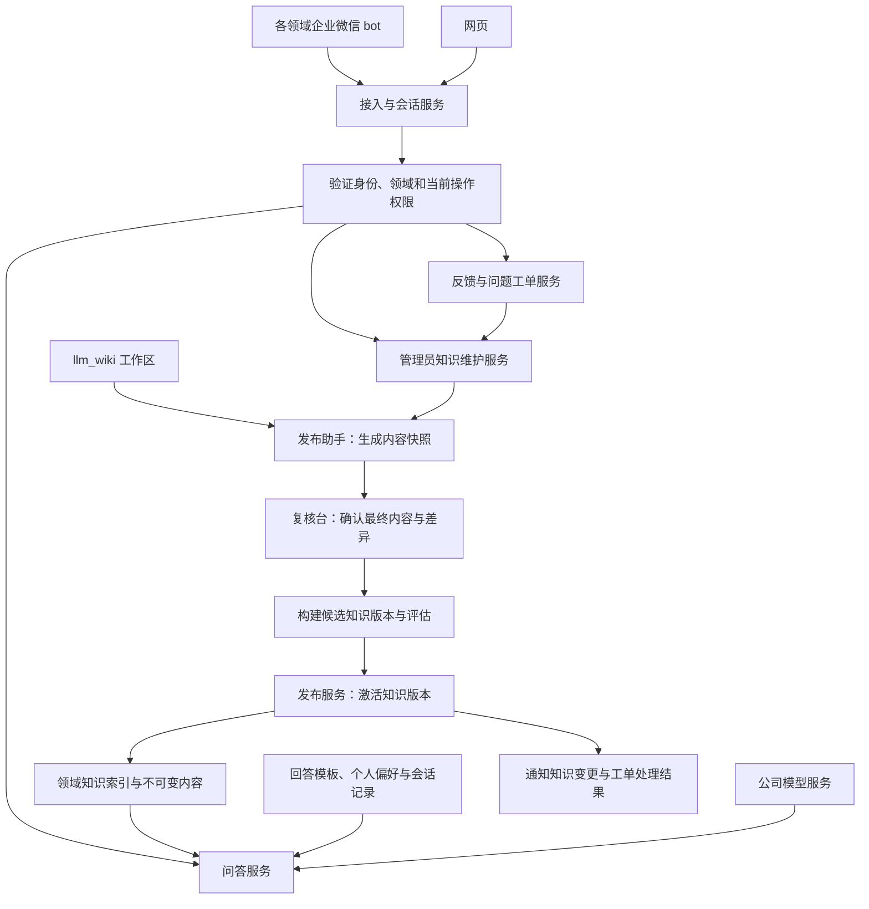

# wikiBot 完整设计文档 v0.4

版本：v0.4（完整实施设计）\
日期：2026-09-26\
状态：设计交付；实现、真实接口联调、性能与上线验收尚未完成。\
适用仓库：OptionsRight/wikiBot。

本文整合 v0.2 基线、v0.3 人群/权限/反馈需求、独立设计审查与成本评估。采用现有自研方向，复用 llm_wiki 作为知识维护源，公司模型通过内部适配接口接入，Pi 为候选 SDK。本文定义项目需要实现的接口和协议；这些并非上游产品已经提供的能力。

本文是当前规范性设计。旧 v0.2、v0.3 与旧 HTML 保留作历史记录；出现差异时以本文为准。审查中的 F1–F5 在本文补充了具体设计契约，状态为“待实现和验证”，未将补充文档等同于测试通过。

## 阅读导航

1. 目标与范围：业务边界、首批流程、成功标准。
2. 总体架构：模块、数据流与部署边界。
3. 知识接入与发布：快照、写回、不可变版本、并发与回滚。
4. 问答链路：流程结构、风格、引用、模型与工具预算。
5. 身份、权限和偏好：不同人群与不同能力分别建模。
6. 反馈、问题登记与管理员知识维护。
7. 性能、容量和统计口径。
8. 数据、接口、任务恢复与渠道交付协议。
9. 实施阶段与验收矩阵。
10. 审查跟踪及外部验证条件。
11. 部署、运维、数据生命周期与安全边界。
12. 人力、工期、运行成本与分期范围。
13. 资料、版本依据与文档关系。

## 1. 目标与已经确认的范围

建设一套通用知识问答框架，各业务领域复用 nashsu/llm_wiki 管理知识，通过统一发布入口接入。每个领域使用独立企业微信 bot，共用后台服务；网页支持问答、查看引用、反馈、问题登记与跟踪，以及管理员的知识修订和发布。企微 bot 按用户权限提供相应入口，复用同一套业务接口。

首个领域为广告，试点覆盖新渠道接入、腾讯广告新增代理商、腾讯 RTA 新增策略。新增代理商已确认是固定流程；其余流程的分支需要在整理知识时确认。用户需要完成准备和配置，首版只提供指导，不读取广告系统实际状态、不执行配置。

已确认要求：

| 项目 | 首版决定 |
|---|---|
| 模型与框架 | 使用公司批准的模型服务；暂沿用 v0.2 的 Pi SDK 候选方案，通过 ModelGateway 隔离；不使用 Dify |
| 领域接入 | 统一复用 nashsu/llm_wiki；不做通用网站爬虫或其他 Wiki 连接器 |
| 人群与回答风格 | 首版提供业务视角、技术视角，支持入门/熟练等解释深度；领域可配置模板 |
| 操作权限 | 首版为领域普通成员、领域知识管理员；普通成员可问答、反馈和登记问题，管理员增加知识维护与工单处理能力 |
| 知识可见范围 | 拥有同领域知识访问资格的成员查询同一套已发布知识；草稿、工单和私人会话另行检查访问范围 |
| 记忆 | 个人偏好长期保存，保留当前会话上下文；不做任务进度记忆 |
| 反馈与问题登记 | 既能针对答案反馈，也能直接登记未解决的问题；统一工单跟踪，知识修订和发布独立记录 |
| 性能 | 普通知识问答至少 95% 在 3 秒内开始输出有用内容，10 秒内完成 |
| 成功标准 | 业务能够自行完成操作为主要目标；减少专家答疑与知识持续改善为辅助指标 |

首版不做跨领域联合回答、自动学习所有历史聊天、实际业务任务执行与进度管理、多 Agent 协商、自主联网补充业务事实或模型微调。问题工单只跟踪答疑与知识改进，不记忆或推进客户开户、广告配置等实际业务任务。领域访问资格、回答风格、操作权限分别建模，不能由其中一项推导另外两项。

## 2. 总体结构与责任边界



图中的授权节点表达所有业务操作必须经过的检查；各 API、工具执行与异步作业仍须分别执行检查，不能仅在登录或入口检查一次。

| 模块 | 负责 | 不负责 |
|---|---|---|
| llm_wiki | 原资料整理、知识编写与维护 | 在线多人问答的可用性、平台发布授权 |
| 发布助手与发布服务 | 快照、复核、索引、评估、激活、撤回 | 在未经确认时生成新的业务规则 |
| 知识服务 | 按领域和版本检索、读取完整流程、提供引用 | 用户身份选择、答案表达 |
| Pi 问答服务 | 组织上下文、调用模型、受限工具执行、流式回答 | 决定谁有发布权限 |
| 业务服务 | 身份、领域角色、会话、回答风格、偏好、审计 | 根据用户自称或模型输出授予权限 |
| 工单服务 | 答案反馈、问题登记、补材料、处理进度和解决确认 | 将工单关闭等同于用户业务操作已完成 |
| 知识维护服务 | 管理员修订草稿、来源写回、复核与发布申请 | 将模型生成的草稿直接变成线上知识 |
| 企微与网页适配器 | 消息收发、展示和交互 | 各自维护另一份知识或记忆 |

建议工程形态为 TypeScript 模块化服务，按部署需要拆分入口进程和异步 worker；首版不拆成大量微服务。持久化数据放关系数据库，不可变知识内容放公司对象存储或受控文件存储。消息、反馈、发布和通知使用数据库任务表/outbox，可重试并保证幂等。

## 3. “提供 Wiki 地址即可接入”的实际契约

### 3.1 地址是什么

接入地址定义为本框架的“已发布知识入口”，例如 `https://knowledge.internal/domains/ads/manifest.json`，不是工作人员电脑上的 localhost API，也不是任意 Wiki 网页。示例域名与下文接口均为拟议设计。

llm_wiki 当前的 MCP 服务转发本地桌面 API，要求桌面应用运行，因此线上请求不依赖该桌面进程。[S1]

第一次建立平台时开发一个发布助手，在能读取 llm_wiki 工作区的位置运行（维护者机器或公司服务器）。它读取选定页面、生成内容快照并提交到发布台。复核发布后，生成稳定知识入口地址。后续 bot 管理员填入此地址，平台读取描述信息，查找并绑定此前已创建的领域实例，不重复创建领域。

“只填地址”覆盖知识接入体验；企微 bot 凭据、公司模型连接、身份目录与首位负责人属于一次性开通配置。不能从地址自动推断密钥和授权。平台提供默认业务/技术回答模板，知识管理员可预览并配置领域称谓；模板调整按配置版本发布。领域开通、bot 凭据管理和权限授予使用平台配置权限，不因获得某领域的知识管理权限自动开放。

### 3.2 新增领域的步骤

1. 有平台配置权限的人员先创建 pending 领域，指定知识管理员、访问范围，并签发仅属于该领域的发布助手凭据。
2. 领域维护者配对一个受控 llm_wiki 工作区，手动提交页面快照、来源关系和候选变更，负责人在网页复核。
3. 构建候选索引并运行该领域评估，生成受平台信任的发布记录与稳定入口地址。
4. bot 管理员登记该地址，平台解析出已经创建的领域，并绑定企业微信 bot；复用入口时无需再次导入原始资料。
5. 用该领域试题验收后启用。后续内容更新走同一发布链路，不修改框架代码。

首版助手由领域维护者手动运行，一次只绑定一个工作区；不要求自动常驻扫描。后台展示最后提交、最后发布与待处理状态，助手离线不影响已经发布的在线知识。平台无法凭空知道离线工作区的改动，不能把“线上仍可用”显示成“与本地始终最新”；变更生效前发布仍由指定负责人落实。

### 3.3 发布格式

在 llm_wiki 原有文件之外，助手生成平台自己的 manifest 和领域配置，不假定这些字段为 llm_wiki 原生功能：

```json
{
  "schema_version": "1",
  "domain_id": "ads",
  "release_id": "ads-r0001",
  "parent_release_id": null,
  "published_at": "2026-09-25T08:00:00Z",
  "pages": [
    {
      "id": "tencent-agency-onboarding",
      "path": "procedures/tencent-agency.md",
      "sha256": "<content-hash>",
      "kind": "procedure",
      "title": "腾讯广告新增代理商",
      "source_refs": ["sources/agency-guide#section-2"],
      "links": ["terms/advertiser-account"]
    }
  ]
}
```

发布服务根据实际审核记录生成 manifest；不信任源文件自称 `approved: true`。每页内容哈希绑定复核记录，审核后再修改文件必须重新复核。稳定文档 ID 保持引用可追溯，改名不改变 ID；删除和替换通过新版本体现。

流程页需要：适用范围、前置条件、准备材料、完整步骤、协作岗位、验收标准、常见问题、负责人、复核时间。缺失关键流程字段时阻止该页作为流程指南发布；普通概念页采用较轻模板。

只发布审核通过的页面与被允许引用的来源摘录；原始材料不是默认全部上线。链接闭包检查确保回答需要的步骤、术语及来源能在同一发布版本中读取。llm_wiki 自动生成的摘要、评论或待复核草稿不能绕过这条边界。

助手首版协议固定如下，作为实现与第二领域接入验收的契约：

| 项目 | 首版支持及处理 |
|---|---|
| 内容 | UTF-8 Markdown、常见标题/列表/表格/代码块；读取 YAML frontmatter，保留原字段但不执行其指令 |
| 内部链接 | Markdown 相对链接、`[[path]]`、`[[path#anchor\|label]]`；解析到规范路径与稳定 ID，歧义、越界路径和必要死链阻止发布 |
| 稳定 ID | 发布助手维护独立映射清单；改名需声明旧 ID 的新路径，不能仅靠标题或相似度猜测 |
| 来源 | 提交被选中的文本摘录、原来源路径/标识和内容哈希；源材料未获准公开时只展示可公开引用说明，不下发原件 |
| 附件 | 仅发布人工选定的静态图片等白名单资源，携带媒体类型、大小与哈希；未知附件报错，不在问答时临时解析远程 Office/PDF |
| 快照包 | 页面、来源摘录、附件及 ID 映射形成完整清单；服务端逐项校验哈希与所属领域，上传完成才创建候选版本 |
| 提交与重复 | `submission_id + bundle_hash` 幂等；中断上传可以重试，缺文件或内容变化的包不进入复核 |
| 写回 | 首版输出修订包，由维护者在停止编辑/导入的维护窗口应用；无法保证单写者时仅供人工合并，再重新快照 |

配置、来源映射及附件清单均存放在助手专用目录或平台记录中，不要求修改 llm_wiki 内部数据库。阶段 0 须交付实际小工作区的安装、导出、改名、引用、纠错和再次导出操作说明。

### 3.4 版本生命周期与统一发布事务

首版使用关系数据库中的领域发布记录作为唯一权威：
`DomainPublication(tenant_id, domain_id, active_release_id?, publish_epoch)`。
`publish_epoch` 单调增加，不因回滚而减少。内容包、索引与描述对象不可变，只有发布状态和领域指针可变。

候选记录保存 `base_active_release_id`、`base_publish_epoch`、`descriptor_hash`。来源沿革另存 `source_parent_release_id`，不能把来源父版本与当前可服务指针混为一谈。

| 当前状态 | 允许的后继 | 条件 |
|---|---|---|
| submitted | reviewing / rejected | 包齐全、哈希通过；内容缺陷记录原因 |
| reviewing | building / rejected | 最终内容复核绑定 bundle hash；修改后创建新快照、重新复核 |
| building | evaluating / failed | 不可变索引、流程结构和配置构建完毕 |
| evaluating | ready / failed | 同一 descriptor hash 的质量与兼容性评估通过 |
| ready | active / stale / revoked | 统一激活事务通过，或基线失效/明确撤回 |
| active | retired / revoked | 被新版本替代/回滚替代，或明确撤回 |
| retired | active / revoked | 独立的回滚复核与命令通过，或撤回 |
| failed / rejected / stale | 无原地重新发布 | 修正后创建新候选，保留失败证据 |
| revoked | 无 | 永久禁止再激活；修复必须生成新版本 |

未激活的 submitted/reviewing/building/evaluating/ready 版本均可因基线 epoch 改变进入 stale，或因明确撤回进入 revoked；这些是表中主路径之外的统一失效转换。

**激活、撤回、回滚共享同一个领域行锁。** 统一锁顺序为领域发布记录、操作者授权记录、目标对象；撤权和写操作共享相同授权记录的锁，避免权限检查后被撤销仍提交。发布命令携带幂等键、预期领域指针/epoch、目标 ID、描述哈希和理由。

激活在同一数据库事务内执行：

1. 锁定领域发布记录并读取当前操作者权限；核验领域和 `knowledge.publish`。
2. 检查候选为 ready、描述和所有内容/索引已就绪、复核与评估针对同一不可变内容。
3. 同时比较候选的 `base_active_release_id == 当前 active_release_id` 与 `base_publish_epoch == 当前 publish_epoch`。空指针也必须明确比较。
4. 检查候选未撤回，复核者/发布者满足当前资格；其审批未被撤销，来源更正检查仍有效。
5. 原 active 若存在则置 retired；候选置 active；更新领域指针并增加 epoch。
6. 同事务记录审计、命令结果和 outbox，提交后返回真实 release ID。后续通知失败只重试通知。

任何检查失败都不改变在线版本。并发候选中只有一个能基于同一 epoch 激活；另一候选变为 stale，重新获取基线、合并、复核和评估后提交。所有未激活的候选在 epoch 改变后均不能继续使用旧基线，即使内容恰好相同。

**撤回事务：** 在相同领域锁内核验 `knowledge.revoke`，将目标版本标为 revoked，增加 epoch，使本领域旧 epoch 的全部待激活候选过期。若目标正是 active，则将 active 指针设为空，领域进入知识维护状态；撤回历史版本时保留当前有效指针。异步构建完成也不能把已过期或撤回记录重新设为 ready。

**修复事务：** active 为空时，新候选明确使用 `base_active_release_id=null` 和最新 epoch；可基于旧内容制作修复包，但必须包含更正依据、重新复核和评估。不能因历史父版本已撤回而永久无法发布，也不能复制旧批准记录恢复错误内容。

**回滚事务：** 创建独立的回滚审批，绑定当前指针、当前 epoch、目标不可变描述哈希及理由。目标必须是已复核为仍然有效的 retired 版本，且部署配置仍可用。持 `knowledge.rollback` 的管理员执行命令，按统一锁顺序重新核验后切换指针、增加 epoch、记录审计/outbox。回滚不复用目标旧候选的 base epoch；revoked 版本始终禁止回滚。没有安全目标时保持维护状态。

请求接收时固定当前 release 和描述对象，普通更新不会将单个答案切换到新旧混合版本。retired 版本可完成已经接收的回答；新的请求只使用当前 active。撤回优先于固定版本：新检索、工具读取及实际外发前均检查当前撤回状态和访问资格，状态无法验证时停止输出。

出站调度器在真正交给渠道 SDK 前检查，不能仅在较早入队时检查。已经进入网络或已经显示的消息无法跨系统原子撤销；网页显示失效标记，企微发送有稳定编号的更正通知，记录 acked/failed/unknown。撤回提交到停止发送的传播耗时单独测量。旧内容的审计读取须具有相应资格，日常问答不能把历史证据重新当作当前知识。

### 3.5 不可变 ReleaseDescriptor

首先读取发布描述对象，再按其精确版本加载配置。禁止分别读取“最新知识”“最新提示词”“最新模型配置”组装一个未经评估的组合。

| 描述字段 | 约束 |
|---|---|
| tenant_id / domain_id / release_id / schema_version | 服务端签发并绑定所属范围 |
| bundle_hash / manifest_hash | 覆盖规范化清单、所有页面、流程结构、允许公开的来源及附件 |
| index_build_id / retrieval_config_hash | 固定索引、分词、别名、排序、embedding 配置（若有） |
| procedure_schema_version / renderer_version | 固定流程节点、分支和确定性清单呈现规则 |
| model_deployment_id / provider_model_revision | 固定公司部署标识和供应方可提供的实际版本 |
| model_parameters / model_adapter_version | 温度、输出预算、上下文预算、工具协议及适配版本 |
| system_prompt_hash / response_profile_versions | 固定公共规则及可选风格模板；本轮选择只能落在这组模板内 |
| output_protocol_version / tool_policy_version | 固定分段结构、允许工具、次数及 deadline 策略 |
| evaluation_suite_version / acceptance_policy_version | 固定试题、判断依据和验收规则 |

描述使用规范化序列化计算 `descriptor_hash`；不包含后写入的评测结果、激活时间和可变发布状态，避免结果哈希与被测对象形成循环。EvaluationRun 单独记录 subject_descriptor_hash、题集版本、结果哈希；ReleaseValidation 绑定描述、最终内容复核、评测结果和发布基线。

初次复核确认最终内容；ready 后的明确发布操作还展示配置摘要和评测结果。内容或配置任何一项变化须生成新描述并补做受影响评估；相同内容包可复用，不要求为了模型/检索配置变更重新写入 Wiki。

每个 Answer 保存实际使用的描述哈希、模型部署/可观测版本、风格模板和偏好快照。密钥只作为服务端凭据引用，不写入描述或答案记录。供应方仅提供可变别名时，必须标明底层版本不可完全固定，使用已知变更通知和固定样本回归；发现变更暂停沿用旧容量/质量结论，重新验证后发布配置版本。此处不声称能探测所有未公开的供应方变更。

## 4. Pi 使用方式与问答链路

初始候选使用 `pi-ai` 封装公司模型接口，需要受限工具循环时使用 `pi-agent-core` 管理工具调用及流式事件。普通确定性链路可直接调用内部 ModelGateway，不额外引入 Agent 循环。Pi 官方文档提供上下文处理与事件订阅机制；这里的领域服务、关系数据库会话和业务偏好属于我们自己的实现。[S2][S3]

通过内部 `ModelGateway`、`AgentRunner` 封装 Pi 调用，固定依赖版本。企业微信消息、发布协议与数据库模型不依赖 Pi 的内部消息类型，以便升级或替换。

### 4.1 普通问答的快速链路

1. 网关根据已认证的 bot ID / 网页领域入口确定 `tenant_id + domain_id`，识别用户，分配 answer ID。
2. 在服务端核验领域访问资格和问答能力，固定当前 release 及不可变 ReleaseDescriptor，再读取其指定模板、用户偏好和当前会话。展示风格不参与授权决策。
3. 使用问题、近期用户原话和必要实体进行检索；默认不额外调用模型做意图分类或改写。
4. 先以领域术语别名、标题与关键词查找流程；需要时加入公司批准的 embedding 检索。中文字词检索必须验证分词质量，不能直接假定数据库默认英文全文索引可用。
5. 取回命中流程的完整结构与关联页；服务端按已确认分支生成必要清单，模型通常调用一次，补充基于证据的解释，经过校验后按段返回。
6. 分别记录证据集合、回答模板/提示词版本、授权版本、耗时、模型用量和答案状态。摘要、统计和工单归因进入异步任务。

索引按领域与版本隔离。向量服务未批准时先建立关键词基线，并以检索评估决定是否满足验收；没有 embedding 不代表关键词一定足够。

上下文按完整章节选取，不在必要步骤中途截断。问题可能对应多个流程时先明确对象；缺关键依据时说明缺什么，关联负责人。检索分数仅用于排序，不当作答案真实概率。

### 4.2 复杂问题与受限工具

跨页面解释或普通链路证据不足时，允许 Pi 调用受限工具：`searchPublishedKnowledge`、`readPublishedPage`、`getRelatedPages`。工具的领域、版本由服务端注入，模型不能自行更改。

首版默认最多 2 次模型调用、1 轮补充读取，由 AgentRunner 在代码中执行调用计数、deadline 和取消，不仅写在提示词里；超出预算转为明确追问，或提供登记问题的入口，由用户发起提交。普通问题不能为了掩盖超时而临时标为复杂问题。反馈分析是独立异步作业，允许更长预算，按工单显示进度。

不向普通问答实例开放 shell、任意网络访问、源文件写入或发布工具。反馈和问题登记通过工单服务处理；管理员明确发起知识维护时进入独立维护流程，工具按当前能力白名单开放。维护流程可以使用同一个模型适配层，无需新增自主 Agent。

问答读取工具仍只有已发布知识检索与读取；工单入口调用 createTicket、appendOwnTicketEvidence、getOwnTicket；管理员维护入口可调用 createKnowledgeDraft、updateKnowledgeDraft、submitKnowledgeDraft、getKnowledgeDraft、getKnowledgeRevisionStatus。工具名为本项目拟议接口。服务端为所有工具注入 actor、tenant、domain 和对象范围，模型不能覆盖。复核、激活、撤回和回滚由已认证的业务命令执行，不向模型提供直接操作线上版本的工具。

### 4.3 可执行的流程结构与完整性判断

三个首批流程必须由负责人确认结构化 ProcedureSpec，随 Markdown、来源映射一起快照和复核。这是本项目的伴随数据文件，不能假设 llm_wiki 已经维护同名字段；发布助手负责映射，负责人确认其与正文一致。

| 字段 | 定义 |
|---|---|
| procedure_id / version / page_id / page_hash | 稳定流程标识、版本和所对应的页面内容 |
| scope / owner / reviewed_at | 适用范围、业务负责人、复核时间 |
| inputs | 需要用户明确提供的字段、类型/枚举、是否必需、澄清模板 |
| nodes | 稳定 node_id、kind、已审核正文、依赖节点、版本化证据引用 |
| always_required_node_ids | 所有适用分支都必须包含的条件、材料、限制与检查项 |
| branches | branch_id、有限条件表达式、所需节点集合、完成标准节点 |
| aliases / clarification_options | 经复核的流程名称、术语与歧义选择项 |

node.kind 包括 applicability、prerequisite、material、step、constraint、completion。分支条件仅允许类型化字段的 eq/in 和有限 all/any 组合，禁用任意脚本执行。构建时验证节点唯一、引用有效、依赖无环、分支输入类型和每个分支的必要完成标准；无法判定的条件返回 unknown，不能把缺失值当成 false。

以下只是结构示意，实际广告流程内容须由业务负责人提供：

```json
{
  "procedure_id": "example-only",
  "version": "1",
  "inputs": [{"id": "scenario", "type": "enum", "values": ["new", "existing"], "required": true}],
  "always_required_node_ids": ["precondition"],
  "branches": [
    {"id": "new", "when": {"field": "scenario", "op": "eq", "value": "new"}, "required_node_ids": ["prepare", "submit", "verify"]},
    {"id": "existing", "when": {"field": "scenario", "op": "eq", "value": "existing"}, "required_node_ids": ["check-existing", "verify"]}
  ],
  "node_ids_in_nodes": ["precondition", "prepare", "submit", "check-existing", "verify"]
}
```

此示意省略了 page、nodes 正文、证据和负责人，不是可直接发布的完整包；正式 JSON Schema 必须拒绝缺失这些必需字段的候选。

首版采用**服务端生成必要清单，模型补充解释**的方式：

1. 标题、别名和检索结果确定流程候选；多个合理候选时先让用户选择，不凭最高检索分数强行选定。
2. 分支输入来自本轮及当前会话中用户明确提供、通过类型校验的值。模型抽取的值仅作建议；不能可靠映射时展示待确认字段。系统说明选择依据来自用户提供的信息，不声称已检查实际广告系统状态。
3. 缺少必需输入时，由程序使用 inputs 的审核模板和允许选项提出澄清。自由生成的无引用文本不能作为 clarification 直接外发。澄清尚未得到分支，不标为完整操作指南。
4. 计算 `required_nodes = always_required ∪ selected_branch.required ∪ dependencies`，包含前置条件、材料、限制、步骤和完成标准。
5. 根据拓扑顺序和已审核正文生成清单，所有风格保留相同 required_nodes。入门解释术语，熟练压缩背景；模型不能改写必需节点中的关键规则。
6. 模型基于同一证据补充解释和允许的示例。它可以省略无必要的背景，不能让模型自己声明“已覆盖全部步骤”作为校验依据。
7. 服务端从实际持久化/呈现记录计算覆盖率，完成时要求 `required_nodes ⊆ rendered_node_ids`，且依赖顺序、版本、分支均有效。缺项或输出预算耗尽则 incomplete。
8. 渠道适配后的正文也要保留全部必需节点；网页已完整而企微只发链接，不能判企微流程答案完整。

用户明确只询问术语或某一步的含义时，可按固定的解释类路由作短答，不伪称已交付完整流程。普通/解释/澄清分类由发布版本中的规则固定；生成后不能为规避漏步骤或超时而改类别。多个分支的概览必须显式标出各分支条件，不把互斥操作拼成一条执行路径。

程序可证明的是清单覆盖、引用范围和协议正确。业务正文是否正确、分支是否符合问题、模型解释是否受来源支持仍靠人工核对的评测和试点反馈验证。错误知识不能靠结构校验自动变成正确知识。

### 4.4 输出协议、引用和回答风格

业务视角默认呈现适用条件、准备清单、操作步骤、协作岗位、完成标准；技术视角基于同一事实补充配置含义、依赖及排查依据。概念解释和短追问用简短模板。角色和展示视角分别处理。

内部持久化的 AnswerBlock 至少包含：
`answer_id, attempt_id, seq, type, text, evidence_ids, procedure_node_ids, content_hash`。
其中序号、版本、已渲染节点与权限范围由服务端生成或验证；模型不能覆盖。

| 块类型 | 生成来源 | 外发条件 |
|---|---|---|
| procedure_node | 服务端读取已批准节点并呈现 | node ID 属于本次 required_nodes，证据与正文哈希匹配 |
| explanation / factual | 模型基于本次证据生成 | 闭合结构、允许类型、非空有效引用、长度和当前版本校验通过 |
| clarification | 服务端输入字段模板 | 仅允许字段 ID、已批准问题模板和选项；不含模型自由操作建议 |
| gap / status | 服务端固定模板 | 明确说明缺知识、失败、维护中或工单真实状态，不编造业务规则 |
| final | 服务端计算 | 汇总 protocol_valid、checklist_complete、generation_state；模型结束标记不直接触发成功 |

引用由知识服务生成并映射到本次实际读取的版本化页面、节点或来源摘录。引用存在不代表语义一定正确，需单独做证据支持评估。来源冲突尚无负责人裁决时停止给出确定操作建议，说明冲突；是否登记工单由用户主动决定。

流式先接收完整的模型结构块，校验后保存，再向出站队列提交。模型的原始 token、未闭合引用、任意自称为 clarification 的内容不得直接透传。发布知识、用户话语、附件和工单内容均作为数据处理，不能修改系统权限或工具白名单。

初始预算为首个模型块最多 256 个生成 tokens、解析缓冲上限 512 tokens、模型整答上限 1,500 tokens；这些是阶段 0 待调值。程序生成的必需清单单独计算呈现字节数与渠道预算，不能靠少算 token 忽略企微长度限制。节点本身超大或完整流程超限时应在构建/评估阶段发现。

结构无效、引用无效、预算耗尽或模型出错时停止未校验部分，保存已有有效块并标记失败/不完整，提供有效来源入口。普通链路不追加模型“修复”来掩盖失败。程序清单与解释的完整状态分别记录；若本路由要求解释但解释失败，联合成功仍为 false。

首段可由检索出的真实流程节点组成，必须与问题直接相关。它可以在模型解释之前返回；“正在处理”或仅提供链接不作为有用首段。网页展示完整清单、版本化引用、反馈和问题登记入口。


## 5. 身份、回答风格、操作权限与记忆

### 5.1 身份与会话

企业微信身份与网页 SSO 映射到同一公司用户 ID；未能验证映射时，不合并个人历史。每次读写校验租户与领域访问资格。同领域获准成员可查询同一套已发布知识；知识草稿、工单、私人问答和管理操作分别检查权限。

默认群聊上下文按 `(tenant, domain, chat, user, conversation)` 隔离。群内发送知识答案前还必须满足群级受众规则：管理员登记允许使用该领域知识的内部群；采用群成员与领域访问范围核验，或经负责人确认、成员变更受控的专用群。成员资格无法确认、出现未授权成员或外部群时不在群内输出知识答案，提示到认证后的网页或本人单聊继续。首版无法接收成员变化事件时必须采用成员变更受控的专用群，不能只依赖历史白名单。个人会话历史不因用户在群里提问而自动带入；偏好仅影响风格，不暴露偏好记录本身。

群里引用某条 bot 答案时，只允许读取该群已展示且当前领域仍可访问的公开答案部分，不导入原提问者的个人上下文。网页可以选择继续本人已有会话。新话题/重置会话生成新 ID；首版建议 24 小时不活跃后新开会话，该时间为可配置默认值。

相同会话串行提交轮次，使用持久化消息序号和版本检查避免交叉覆盖；不同用户请求并发。企微回调以租户、bot 和平台稳定消息 ID 去重，同一投递返回同一逻辑 answer ID 或 ticket ID；模型是否重算与外部消息是否重复按第 8 节恢复协议处理，不能把本地去重等同于外部恰好一次。Pi 实例不能跨用户共享可变会话状态。

### 5.2 人群与回答风格

回答风格使用 `response_profile_id + profile_version` 标识，与授权角色分别保存。首版内置两种视角，解释深度和长度作为独立偏好；新增人群通过受约束的领域模板扩展。

| 展示配置 | 重点 | 示例 |
|---|---|---|
| 业务视角 | 要准备什么、怎么操作、找谁协作、怎样确认完成 | “先准备这些材料，再按顺序提交；完成后检查这些结果。” |
| 技术视角 | 配置字段、接口依赖、校验方式、排查依据 | “这些配置分别影响什么，如何验证，异常时查哪项依赖。” |
| 入门深度 | 解释术语、拆细步骤、给出有依据的示例 | 对业务或技术视角均可启用 |
| 熟练深度 | 精简背景、突出操作差异与检查项 | 同样保留必要条件和完整操作清单 |

模板只能控制组织方式、术语解释、示例密度和语气，不能配置工具权限、隐藏必需步骤或覆盖知识依据。新模板及其变更需要版本化，并使用同一批业务事实和流程题评估。

选择顺序：本轮明确要求 > 用户主动保存的领域偏好 > 领域默认模板。首次使用提供可切换的默认视角，不为判定用户人群额外调用模型。企业目录岗位可用于建议默认值；用户可以选择其他回答视角。仅在用户明确要求保存时更新长期偏好。

### 5.3 操作权限与首版角色

首版提供两种领域角色模板。业务人员和技术人员默认都是“领域普通成员”；“领域知识管理员”在指定领域增加维护能力。管理员也能选择业务视角，选择技术视角的普通成员仍只有普通成员权限。

| 能力 | 领域普通成员 | 领域知识管理员 |
|---|---|---|
| 提问、追问、读取获准的已发布知识与引用 | 允许 | 允许 |
| 选择回答风格、管理本人偏好和会话 | 允许 | 允许 |
| 对本人有权查看的答案反馈、独立登记问题 | 允许 | 允许 |
| 查看本人提交的工单、补材料、确认解决、重新打开 | 允许 | 允许 |
| 查看和处理本领域工单、分派给获准处理人 | 不允许 | 允许 |
| 新增/修改知识草稿、提交来源材料与修订 | 不允许；只能提交建议作为工单证据 | 允许 |
| 复核最终快照、发布、撤回和回滚领域知识 | 不允许 | 允许；须经过相应版本检查与发布命令 |
| 查看他人的私人会话或所有领域的知识 | 不因上述角色自动获得 | 不因上述角色自动获得 |
| 开通领域、配置 bot 凭据、授予管理权限 | 使用独立平台配置权限 | 使用独立平台配置权限 |

问题登记属于普通成员的反馈能力。首版知识管理员可以兼任编辑、复核和发布人，暂不强制增加第二位审批者；每次发布仍需明确审阅最终内容并留下复核记录。未来若需要分工，可以从同一能力集合拆出编辑者、复核者、发布者，无需改变接口边界。

授权使用 `(tenant_id, domain_id, user_id)` 下的角色绑定及其权限版本。首版角色能力模板固定；修改模板作为受控配置迁移，更新受影响绑定的权限版本并重新验证。服务端将角色模板解析为明确能力，包括 `knowledge.read`、`answer.ask`、`ticket.create`、`ticket.read_own`、`ticket.update_own`、`ticket.manage_domain`、`knowledge.draft`、`knowledge.review`、`knowledge.publish`、`knowledge.revoke`、`knowledge.rollback`。领域访问资格是前提。客户端隐藏按钮只是交互表现，不能代替授权。

每个 API 和工具处理器都检查当前身份、领域、能力以及对象访问范围。角色来自已验证的公司目录映射或受控管理配置；用户消息中的“我是管理员”、知识正文里的指令、回答模板字段、模型输出的 role 参数均不能授予权限。对象 ID 不能绕过所属领域与本人范围检查。

异步写回、复核和激活在执行前重新检查发起人的当前授权；权限被撤销时作业进入 blocked 状态，由其他获准管理员显式接手并记录新操作者。平台内的写操作将权限版本检查与对象状态变更放在同一事务中，与撤权使用同一授权记录的锁或条件更新。发布助手领取具体修订任务时核验当前权限，任务绑定内容哈希和执行者；权限检查失败或无法连接平台时不启动受控写回。领取任务前的撤权阻止启动；已经开始的本地写入不承诺跨系统原子撤销。最终激活始终再核验当前权限及已审批内容，不沿用旧会话中的角色快照。平台权限变更、草稿修改、复核、发布、撤回、回滚均记审计事件。

### 5.4 个人偏好与工单记录

| 范围 | 字段示例 | 保存规则 |
|---|---|---|
| 全局 | 语言、回答长短、解释深浅 | 经用户明确设置或明确要求记住 |
| 领域 | 默认回答视角、常用渠道 | 只在对应领域生效 |
| 授权 | 领域角色、能力及权限版本 | 由服务端授权系统管理，不属于个人偏好 |

偏好存结构化字段，不把自由文本长期注入系统指令。用户可通过网页或明确命令查看、修改、删除；当前请求的明确要求优先于已保存偏好，不能覆盖系统权限。岗位信息如来自企业目录应注明来源。

首版不自动从日常聊天推断并保存代理商、客户、策略、完成进度等事实，不建立跨会话的业务任务记忆。当前会话保留最近消息和必要摘要；默认上下文预算上限建议 12k tokens，须按实际模型配置，必要流程证据优先于旧聊天。所有聊天内容作为不可信输入，不覆盖已发布知识。

用户明确登记的问题及处理记录是可查询的业务数据，不能自动作为其他用户答案的知识依据，也不能作为隐藏的长期对话记忆。查询本人历史工单需调用相应业务接口并检查权限。

偏好由用户删除时清除相应缓存。会话内容建议默认保留 30 天；工单、附件、授权及发布审计分别确认保留期和删除规则，不随对话清理静默丢失仍待处理的工单。上述保留建议须经公司政策确认。

## 6. 反馈、问题登记与管理员知识更新

### 6.1 两个入口，统一工单

| 类型 | 入口与用途 | 必需关联 |
|---|---|---|
| `answer_feedback` 答案反馈 | 某条答案错误、过时、遗漏、没找到已有知识或不易理解 | 必须有本人有权查看的 answer ID，关联当时版本和引用 |
| `question` 问题登记 | 直接记录待解答、知识缺失、暂时无法解决的问题 | 不要求已有答案，可选关联本人问题或答案 |

企微支持明确命令和简短表单，网页支持补材料、跟踪与处理。企业微信 SDK 文档列出流式消息、卡片以及反馈事件能力；具体当前租户可用能力需联调。[S4] 卡片不可用时保留明确文字命令和认证网页入口，核心流程不依赖卡片。

普通提问不会自动变成工单。用户明确发出“登记这个问题”“反馈这条答案有错误”等提交操作，且目标明确、必填信息齐全时即可创建并返回编号；不要求再次确认同一个提交。如果对象不明则先补齐信息。模型建议登记、低置信度、模型失败或知识正文中的命令不能自行触发登记。

反馈可以是“步骤不清楚”，问题登记可以是“新渠道的材料没有说明，请负责人补充”。用户提出的修改建议作为工单证据保存；只有管理员能把它转成知识修订。

### 6.2 保存内容与可见范围

工单提交至少包含类型、标题/问题描述、报告人和领域。服务端保存 ticket ID、状态、负责人、时间、来源渠道、幂等键和版本号；有原答案时保存可访问的原问题/答案相关片段、answer ID、release ID、引用和当时回答风格。附件、补充证据及处理记录另表保存。

提交页或首次入口说明：工单正文与附件会向该领域的获准处理人开放。仅附带用户提交和定位问题所需的内容，不把整段私人历史、隐藏提示词或其他用户上下文交给处理人。管理员处理工单的权限不包含自由浏览报告人的其他私人问答。

普通成员能查看和补充本人创建的工单；管理员能处理当前获授权领域的工单。分派对象必须是该领域的获准处理人。内部处理备注和提交人可见回复分别标识，避免将内部备注自动发回用户。

合并重复工单时保留每位报告人的记录与通知关系；报告人只看到自身工单可见的处理结论，不能因合并得到其他工单正文或附件。通过 ticket ID 猜测、跨域查询、读取附件均须执行同样授权。

群聊仅回执工单编号及本人认证后的查看入口。提交内容和后续证据不因创建于群聊而默认向全群开放；结果通知优先网页站内消息及已验证的个人渠道。个人渠道暂不可用时保留站内结果，不转发到其他群聊。

### 6.3 工单状态与解决标准

主路径为 `submitted → triaged → in_progress → resolved → closed`；`in_progress ↔ waiting_reporter` 表示等待补充。另设 `duplicate`、`rejected` 终态，须记录合并目标或不受理原因。

| 状态/操作 | 含义与条件 |
|---|---|
| submitted | 已在数据库可靠保存并返回工单编号，尚未确认处理方案 |
| triaged | 已确认分类、影响范围和处理人；模型分类仅为建议 |
| in_progress / waiting_reporter | 正在解答、修复或维护知识 / 已向报告人提出具体补充要求 |
| resolved | 处理人提交了可核验的处理结果；知识变更类须关联实际生效版本和相关回归结果 |
| closed | 报告人明确确认解决；主动撤回也可关闭，但单列 close_reason=withdrawn，不计入解决数 |
| reopen | 报告人可重新打开本人 resolved/closed 工单，记录原因，回到 triaged |
| duplicate / rejected | 合并或超出受理范围；不得把生成失败、知识缺失直接作为拒绝处理的理由 |

分诊、分派、开始处理、请求补充、标为解决、合并和拒绝需要 ticket.manage_domain；确认解决并关闭、撤回本人提交以及 reopen 由报告人执行。管理员不能代替他人确认解决。waiting_reporter 收到材料后由处理人恢复 in_progress，补材料本身不隐式改变处理结论。关闭后重开保留此前全部处理记录。

工单、知识修订、知识发布分别保存状态。发布成功不直接关闭工单；通知成功也不代表用户确认解决。只有“修订稿已批准”时，知识变更类工单仍为处理中。对需要继续排查的问题，即使某次知识发布完成，也不能自动标为 resolved。

首版不因用户一段时间未回复自动关闭。记录每次状态变化、操作者、理由和对象版本，冲突更新返回冲突结果，不能后写覆盖已关闭或重新打开的状态。

### 6.4 分类与处理路径

| 原因 | 处理方向 |
|---|---|
| 知识错误/过时、缺少知识 | 管理员补证据、提出知识修订，经来源写回和发布生效 |
| 知识存在但没有找到 | 修正别名、检索、排序或内容组织 |
| 引用正确但回答遗漏 | 修正完整流程覆盖、上下文组织、生成规则与评估 |
| 不易理解 | 调整回答模板，补充经过复核的示例或术语 |
| 可以由现有知识解答 | 提供已发布依据和具体解释，无需强行创建知识版本 |
| 实际业务系统故障或超出知识支持范围 | 说明受理边界和转交建议，记录处理结论，不声称 bot 已执行业务修复 |

模型只提出分类、相关知识和修订草稿。处理人决定处理路径并确认公开回复。业务用户能建议修改内容，不能因此写入知识草稿或触发发布。

### 6.5 管理员通过 bot 更新知识

管理员可以从 bot 发起“新增一篇流程”“修正某一步”“补充适用条件”等明确维护请求，也可从工单进入维护。首版交互为：

1. 验证身份、领域和知识维护能力，确定目标页面及基线哈希；依据不足时列出缺失材料，不能编造业务规则。
2. 生成或编辑修订草稿，返回 draft ID、原文/拟改内容差异、依据及受影响页面。bot 明确回执“草稿已保存”及当前阶段。
3. 管理员提交修订，进入发布助手写回队列；源工作区不可用时标为 sync_pending。助手按第 6.6 节完成来源更正、页面修改和再次快照。
4. 管理员在网页审阅最终快照、来源和差异；审批绑定最终内容哈希。生成或写回后的内容有变化时必须重新审阅。
5. 构建并评估候选版本，获准的发布命令绑定候选 ID、内容哈希及基线。满足版本与当前权限检查后才能激活；失败保留线上原版本。
6. 只有激活事务成功才回执“已发布”，给出 release ID 与影响范围。关联工单记录发布结果，再按第 6.3 节判断是否已解决。

首版 bot 负责发起、补充和查询维护进度，网页承接较长差异预览和最终发布操作。企微若能提供可靠的身份绑定交互，可复用同一业务命令增加发布按钮；按钮不能绕过网页使用的检查。在群里发起维护时转到认证的个人维护入口，未发布草稿和来源材料不直接发到群内。

这条链路同时支持管理员主动维护和从工单转来的修订。普通成员直接调用维护 API、伪造管理命令或在问题中夹带“更新知识”的指令时，都不能写入草稿。管理员的普通咨询也不会默认触发更新。

撤回和回滚要求相应能力、明确目标版本及理由，并走第 3.4 节的统一发布控制。曾经获准的旧按钮在权限、内容或发布基线改变后不能继续生效。已发生的发布记录不能因删除会话而消失。

### 6.6 唯一维护源与写回

首版采用维护者触发的导出与应用，不做无人值守双向同步。每个工作区指定一位发布维护者；导出/写回时暂停 llm_wiki 导入和编辑，复制选定内容到暂存区，比较复制前后的逐文件哈希与目录清单，有变化就放弃本次快照。不要假设本框架文件锁能阻止桌面应用写文件。

修订携带 `base_content_hash`，应用前检测原文是否已被改动；有冲突交维护者解决，不覆盖新内容。修订以版本化的“专家更正说明”追加到 llm_wiki 的维护原料中，记录替代的旧结论、适用范围与负责人，再更新关联 Wiki 页面；原始导入材料保持可追溯，不静默篡改历史来源。之后重新导入不能把更正记录丢弃；发布校验按更正记录关联页检查是否发生回退，冲突阻止激活并要求复核。

首版至少人工确认更正记录与生成页一致，不宣称自动语义检查能保证发现所有回退。这个写回适配属于本框架开发，不宣称 llm_wiki 原生提供网页远程修订 API。修订回到唯一维护源后重新提交快照，复核记录必须绑定最终实际发布内容。若无法暂停工作区写入，应使用不再变化的人工导出包；不能直接将正在变化的目录标为已审核快照。

候选版本回测原问题和相关问题后才可激活。通知失败单独重试，不回滚知识版本；工单保留可查询的实际处理结果。严重问题可以先撤回知识，再补齐修订。

检索和回答模板修复也要带版本、跑同一批问题并记录结果；它们不一定需要修改 Wiki。回归题自动生成后由负责人核对，预期答案不能只由被测模型自行判定。

### 6.7 提交、重试与通知

工单创建、首条审计事件和待处理任务/outbox 在同一个数据库事务中写入；事务提交后才返回“登记成功”。幂等范围为 `tenant + domain + actor + operation + idempotency_key`，同时保存请求内容哈希。同一键及同一内容重试返回原工单；同一键不同内容返回冲突，不覆盖原记录。跨渠道使用不同请求键时不会自动认作同一提交，只能提示或人工合并。

工单补充、状态迁移、修订提交及发布命令也使用幂等键和 expected_version。重试读取原结果前仍须检查当前访问资格，不能通过旧幂等键读取已经无权访问的对象。

bot 返回的状态来自业务服务持久化结果，不能由模型自行编造工单编号、处理人或“已更新”消息。异步处理失败可按 job ID 恢复；工单状态可查询。通知独立记录待发、已确认、失败和结果未知，发送结果未知时不将工单创建或知识发布重复执行。问答任务的接收、租约接管、片段持久化和投递恢复按第 8 节执行。

## 7. 响应速度与容量

### 7.1 已确认 SLO 与测量口径

普通流程问答同时报告 P95 首段和完整回答时间，正式验收采用联合口径：至少 95% 的普通请求同时满足首段有用内容 ≤ 3 秒、完整回答 ≤ 10 秒且回答成功。分母为该负载档位下全部普通问答请求，排队超限、服务错误、超时和系统中断均不得从分母移除。用户明确取消的请求单独报告，并在原始总量中保留；不能由系统自动取消来规避失败统计。

首段有用内容必须包含与问题有关的实质性答案，不把“正在思考”、错误提示计入。必要澄清和知识缺口回复作为单独的交互类型报告，其判定规则在测试前固定，不能用快速拒答代替普通流程回答来达标。真实端到端试点同时验证用户感知延迟。

计时从平台入口接受请求开始，包含排队、身份处理、检索、模型、段落检查和发送等待。另记录渠道可观测的发送成功时间；企微客户端真实显示延迟通过试点端到端抽样测量，不能仅凭服务端发送成功声称客户端达标。

普通/复杂问题分类规则由发布前测试集及线上固定规则决定；超时不能事后换类别。无答案请求单独统计，不能用快速拒答改善“有效解决”的指标。被拒绝、超时、模型错误和中断都计入失败率。

初始性能预算（工程假设，非实测）：入口与排队 0.2s，读取上下文及检索 0.6s，模型首段生成 1.8s，检查与渠道发送 0.4s。合计只是定位瓶颈的预算，分段 P95 不能简单相加当作端到端 P95。

### 7.2 降低延迟的措施

- 普通问题一次生成，回答模板、权限和个人偏好直接读取，不额外让模型分类人群或决定权限。
- 问题登记先可靠保存并返回编号，内容分析与知识更新异步处理；分别测量登记回执、工单处理和发布耗时。不能把普通问答改为工单回执来改善问答 SLO。
- 首版不启用跨用户生成答案缓存；缓存已发布页面、索引和查询结果。仅对没有使用个人会话信息的独立查询共享检索缓存，键包含租户、领域、版本、检索配置和完整有效检索输入。使用会话实体的追问要么不缓存，要么加入用户与会话范围；不得仅以“下一步呢”等当前问句跨人命中。禁止缓存拼入个人会话后的上下文供他人使用。
- 在线模型与发布/反馈 worker 使用独立并发配额，防止后台导入占满公司模型服务。
- 根据负载设置有界队列、每用户并发限制和领域公平调度；队列等待计入延迟。超载时明确提示并记录失败，不无限等待。
- 限制不必要解释长度，超长流程在网页完整展示；任何摘要仍要保留关键依赖和完整清单入口。
- 使用显式取消命令、服务端 deadline 与模型取消。网页 SSE 断开只改变该连接的交付状态，生成可在原 deadline 内继续；用户重连按事件序号补读。显式取消、模型断流或 deadline 到期按第 8 节进入终态，半截交付不计成功。

### 7.3 验证负载

用户数、峰值并发、知识规模尚未确认。建议首轮按 3 个领域、每领域 500 页以内，以及 1/5/10/20 个并发问答逐级测量，以取得容量曲线；这些是测试档位，不是承诺容量。

分别测冷缓存、热缓存、无答案、长流程、群聊并发及知识发布期间；普通问题至少采集 1,000 次请求分布，报告 P50/P95/P99、联合达标率、失败率、token 用量、公司模型排队时间和端到端延迟。企微入口请求的完整回答时间取网页完整答案 ready 与企微最终正文交付两个事件中的较晚者；网页入口请求只等待网页完整结果交付，不额外向企微推送。仅发送跳转链接不算完整回答。原流程页面本身可提前查看，但不能把已有原文页面可访问等同于个性化回答已经生成。

最终承诺容量必须绑定模型版本、配额、知识规模、输出长度和并发数；在尚未实测时不承诺 20 并发满足 SLO。测试档位可用样本数据模拟，不要求首版真实上线三个业务领域。

## 8. 数据、接口与运行协议

### 8.1 数据模型与一致性边界

关系数据库建议采用公司已有的 PostgreSQL 服务，首版任务表与 outbox 同库。所有领域对象以 tenant_id、domain_id 约束查询、唯一键和外键；只验证传入对象 ID 而忽略所属范围属于接口错误。

| 对象 | 关键字段与约束 |
|---|---|
| Domain / DomainPublication / BotBinding | 领域、访问范围、负责人；active_release_id、publish_epoch；租户内 bot 唯一绑定一个领域 |
| RoleBinding / PermissionPolicy | 用户、领域资格、角色、状态、permission_revision；同一领域用户唯一 |
| UserPreference / ResponseProfile | 本人结构化偏好；版本化展示模板，不能包含授权配置 |
| KnowledgeRelease / ReleaseDescriptor | 不可变 bundle/descriptor hash、来源沿革、基线指针与 epoch、生命周期 |
| PageRevision / ProcedureSpec / SourceReference | 稳定文档/节点 ID、页面哈希、结构化分支、来源与可公开范围 |
| Review / EvaluationCase / EvaluationRun / ReleaseValidation | 最终复核人/内容哈希、被测描述、人工基线、结果哈希、审批撤销状态 |
| Conversation / Turn | tenant/domain/chat/user/conversation 范围、单调轮次号、当前逻辑答案；(conversation_id, turn_seq) 唯一 |
| Inbox / IdempotencyRecord | 渠道消息 ID 或用户操作键、payload hash、关联业务对象、接收时间；范围内唯一 |
| Answer | 操作者、会话、问题、release/descriptor hash、profile/prefs 快照、生成状态、截止时间、完整性指标 |
| AnswerAttempt | attempt_id、answer_id、worker、lease_until、fencing_token、模型调用记录、状态及失败原因 |
| AnswerBlock | answer_id、seq、attempt_id、块类型、正文/哈希、证据、节点；(answer_id, seq) 唯一 |
| Delivery / DeliveryAttempt | 目标渠道/受众、answer/event ID、stream ID、累计正文哈希、最高序号、回执/未知状态 |
| Ticket / TicketEvent / TicketEvidence | 类型、报告人、处理人、状态、version、可见范围、证据与公开/内部回复 |
| KnowledgeRevision / RevisionTicketLink | 草稿、基线哈希、来源写回状态、最终快照、关联工单；允许多对多 |
| Job / Outbox | 幂等对象、待执行时间、租约与 fencing_token、重试计数、deadline、最后错误 |
| AuditEvent | 真实操作者、授权版本、动作、对象、前后状态/哈希、request/job ID、时间 |
| OperationResult | 幂等命令对应的持久化结果，避免网络重试再次修改业务对象 |

核心业务状态、审计和待发送事件在同一事务提交。对象存储上传先进入暂存区，数据库确认全部文件可读且哈希匹配后才引用；孤立暂存包由延迟清理任务处理，不能删除仍被候选、有效版本、审计或保留规则引用的对象。数据库与对象存储不宣称跨系统原子提交。

### 8.2 接收、会话顺序与幂等

网页写接口要求 Idempotency-Key。范围为 `tenant + domain + actor + operation + key`；规范化 payload hash 覆盖业务参数，不包含重试时间等传输字段。同键同内容返回同一业务对象，同键不同内容返回 409 IDEMPOTENCY_CONFLICT。返回旧结果前仍核验当前权限。

企微接收使用 `tenant + bot + upstream_message_id` 去重；稳定消息 ID 与重放行为是阶段 0 的必测项。接口不能把 SDK 的发送 req_id 当成入站消息唯一 ID。相同文本的两次真实提问是两个消息；不同渠道的新请求也不擅自合并。

接收普通问答的最小事务：

1. 验证可信渠道身份、领域访问资格和问题参数，读取/锁定本人会话序号。
2. 插入或读取 Inbox/IdempotencyRecord；已有记录则返回关联答案。
3. 固定当前有效 ReleaseDescriptor 与所选风格，创建 queued Answer 和 Turn。
4. 在同一事务插入生成 Job、审计事件及必要 outbox，再提交。
5. 提交后返回 answer ID。创建工单或修订使用同样原则，未保存不得回执“已登记”。

新请求发现知识维护中，可持久化一个明确的维护状态结果或直接返回领域维护错误；不能创建一个永远无版本可用的 queued 答案。该结果按其真实路由计入维护/失败统计。

同一会话按 turn_seq 执行，下一轮读取此前已经持久化的终态与有效内容；前一轮失败时保留其失败标记，不能当作完整事实。队列有上限，等待时间计入从接收到 deadline 的总预算。生成终态后可处理下一轮；通知未知不能永久阻塞会话。

### 8.3 Answer、Attempt 与 Job 状态机

生成和投递分开记录：

| 对象 | 状态 | 定义 |
|---|---|---|
| Answer.generation_state | queued → running → completed | 已接收；正在检索/生成；所有要求的有效块和覆盖结果已持久化 |
| Answer 终止状态 | failed / incomplete / cancelled / revoked | 无可用完整输出；已有部分输出但未完成；用户取消；证据撤回 |
| Attempt | acquired → running → succeeded / failed / abandoned | 一次受租约和 fencing_token 约束的执行 |
| Job | pending → running → done / retry_wait / blocked / failed | 执行结果、允许重试、授权/依赖受阻或重试耗尽 |
| Delivery | pending → sending → acked / failed / unknown / suppressed | 尚未发送；已尝试；确认；明确失败；结果不可知；因权限/撤回取消发送 |

completed 表示生成完整，**不等于渠道已收到或业务已解决**。单独保存 protocol_valid、checklist_complete、required_delivery_complete 与业务反馈。联合成功由这些条件及固定测试类别计算，不由模型返回 success 字段决定。

执行中的撤回使生成进入 revoked；已经 completed 的历史答案保留原完成记录，另标 validity_state=revoked，当前读取和投递仍被阻断。生成终态不被迟到结果覆盖；完成后取消只抑制尚可阻止的投递，不抹去已经发生的生成与交付记录。

worker 领取任务时通过原子更新获得租约并增加 fencing_token，心跳续租。所有状态提交、块写入、任务完成与投递入队都要求 token 仍然匹配且 lease 未过期；仅检查进程本地状态不够。旧 worker 即使稍后拿到模型结果，也不能覆盖新执行者的数据。deadline 独立于租约，过期答案由恢复任务进入终态；租约续期不延长用户请求预算。

恢复策略选择保守且可说明的行为：

- **尚未调用模型、没有任何外发尝试：** 有剩余 deadline 时可接管任务；复核当前授权、版本状态后继续。
- **完整答案已持久化：** 恢复其投递或让网页按事件序号补读，不重新调用模型。
- **模型已经开始调用但结果是否完成不可知：** 首版不自动重新生成并拼接另一份答案。旧答案进入 failed 或 incomplete，用户可显式重试，生成新的 answer ID 并关联 retry_of。
- **已有部分有效块：** 保留并标明不完整，不能将新一次生成冒充原回答的续写；未发送的旧块受终态/撤回检查约束。
- **外部发送结果未知：** 转交独立 Delivery 恢复，不重新创建工单、发布知识或生成答案。
- **权限撤销：** 问答停止，维护 Job 进入 blocked；其他合格管理员须显式接手并重新核验基线，服务账号不能代替原发起人授权。

每次模型调用在执行前记录调用意图与计数。普通链路正常为一次，复杂链路最多两次、一次补充读取；隐式 SDK 重试应关闭或纳入相同预算。网络失败不能证明供应方未计算或未计费，因此不承诺模型调用恰好一次。

允许重试的数据库/上传任务使用有界退避和最大次数，超过预算进入可查询失败状态。默认尝试上限和退避值放部署配置，发布、写回、通知分别配置；缺配置不得使用无限重试。生成任务始终受原始 deadline 约束。

### 8.4 企业微信与网页交付

**企业微信连接归属：** 首版一个 bot 只有一个明确的入口进程拥有长连接。worker 可并行计算，所有出站消息经过该入口。滚动更新先停止旧入口接收并排空/终止其队列，再启动新入口；首版不声称具有无缝自动接管。以后实现高可用时需单独加入连接租约、防旧实例发送及切换验证。

每个 answer 固定 stream ID；内部 AnswerBlock 先转换为按序累计的已校验正文，后续更新使用相同 stream ID。维护 `answer_id ↔ stream_id ↔ delivery_attempt/req_id` 映射，req_id 用于一次协议确认，不能作为逻辑业务 ID。

同一流最多一条外部请求等待确认，后续块合并为最新累计快照，避免较旧正文覆盖较新正文。合并更新保留块序号和节点集合，不能丢失必需内容。控制队列长度、协议速率和每 bot 并发；具体协议上限以固定 SDK 和实际租户验证为准。

出站调度顺序为：读取已提交块→确认当前授权/群受众/撤回状态→检查序号和 UTF-8 字节预算→将发送意图持久化为 sending→实际调用 SDK→记录 ack/错误/超时。最终帧包含完整累积内容并标记结束，只有最终回执确认才能记为企微完成交付。

字节预算按实际 UTF-8 编码计算，包含标题、引用和附加信息。完整必需清单超过单次流的已验证上限时，首版返回明确的渠道长度限制状态和网页入口，企微完整交付为 false；不能偷偷截掉最后几步并计成功。多消息分段属于后续需要验证顺序、受众与完成确认的独立交付模式。

**断线与未知结果：** 等待回执超时记录 unknown。恢复前确认该消息类型是否可在原 stream ID 上安全重发累计正文；有验证证据才恢复该流，否则保留可查询网页结果并显示交付未确认。工单/更正等通知有稳定 notification_id，重试可能导致外部重复显示，消息应能识别同一事件；不承诺外部恰好一次。

**网页：** POST 创建逻辑答案，GET events 读取持久化事件；事件 ID 为单调 seq，客户端用 Last-Event-ID 重连、按 answer_id + seq 去重。断开连接不创建新答案、不重跑模型；显式 cancel 才请求取消生成。最终内容已持久化后仍可通过 GET 查询。

网页事件重放与每次读取同样核验当前访问资格和撤回状态，历史持久化块不能绕过撤回禁令。记录服务端完整事件交付与可采集的客户端最终接收确认；服务器写入 socket 不等同于用户已阅读。网页正式端到端测量采用已固定的客户端接收埋点口径，企业微信采用 SDK 回执并加真实客户端抽样，报告各自观测限制。

群聊发送前确认群受众。权限、群范围或版本无法确认时抑制发送并记录原因，不能将带私人内容的备用通知发到其他群。已进入网络的内容仍存在撤回在途窗口。

### 8.5 业务 API 契约

以下为本项目拟议接口，不是 Pi、llm_wiki 或企微的原生接口。网页以认证后的领域入口确定 domain，渠道以 bot 绑定确定 domain；客户端传参仅作一致性检查，不能覆盖可信身份和领域。

| API | 行为与返回 |
|---|---|
| POST /domains | 平台配置权限创建 pending 领域、负责人及访问范围 |
| POST /bot-bindings | 平台配置权限解析可信发布入口并绑定已有领域 |
| POST /answers | 幂等创建本人答案；202 返回 answer_id、status、events_url、result_url |
| GET /answers/{id} | 本人答案或获准群中已公开部分；同时检查当前访问与撤回状态 |
| GET /answers/{id}/events | 有权限的持久化事件流及重连补读；禁止重放失效业务正文 |
| POST /answers/{id}/cancel | 本人显式取消；持久化请求并停止后续可阻止的生成/投递 |
| GET/PATCH/DELETE /me/preferences | 本人白名单偏好，PATCH 支持版本检查 |
| GET /me/capabilities | 当前领域能力及 permission_revision，仅供展示，操作仍独立授权 |
| POST /tickets | 幂等创建 question/answer_feedback；返回已持久化 ticket ID |
| POST /answers/{id}/feedback | 上项的便捷入口，同一工单服务及权限 |
| GET /tickets、GET /tickets/{id} | 普通成员本人范围；管理员获授权领域范围 |
| POST /tickets/{id}/evidence | 本人或获准处理人补材料；检查附件、可见性及对象版本 |
| POST /tickets/{id}/transitions | 固定状态转换；携带 operation、reason、expected_version |
| POST/PATCH /knowledge-drafts[/{id}] | 管理员创建/修改草稿，绑定页面基线哈希和 version |
| GET /knowledge-drafts/{id}、GET /revisions/{id} | 管理员查询完整维护记录；报告人通过工单获取允许公开的摘要 |
| POST /knowledge-drafts/{id}/submit | 创建来源写回任务；202 返回 revision/job ID，不返回“已发布” |
| POST /revisions/{id}/review | 复核最终 bundle hash 与差异；记录通过/拒绝和原因 |
| POST /releases/{id}/activate | 明确发布命令；检查当前指针/epoch、审批、描述和权限 |
| POST /releases/{id}/revoke | 明确撤回目标、理由、预期 epoch；统一撤回事务 |
| POST /releases/{id}/rollback | 目标为拟恢复版本；检查回滚审批、当前基线和有效性 |
| POST /submissions | 配对助手提交完整快照，绑定 submission_id、bundle_hash 和工作区 |
| POST /helper/jobs/claim | 受控助手领取指定范围修订任务，核验当前操作者资格及内容哈希 |
| POST /helper/jobs/{id}/result | 绑定 lease/fencing_token 回报写回及新快照结果；不能自行激活 |

写接口通用规则：Idempotency-Key 必填；更新既有对象时携带 expected_version；发布额外携带 expected_active_release_id、expected_publish_epoch 和 descriptor_hash。服务端创建 actor、tenant、domain、审计字段，模型/客户端同名字段不得覆盖。

错误统一包含 `error.code, message, request_id, retryable`，不泄露他人对象详情。建议固定码：UNAUTHENTICATED、FORBIDDEN、NOT_FOUND、INVALID_INPUT、IDEMPOTENCY_CONFLICT、VERSION_CONFLICT、BASELINE_STALE、KNOWLEDGE_UNAVAILABLE、RELEASE_REVOKED、RATE_LIMITED、DEADLINE_EXCEEDED、DELIVERY_UNKNOWN、DEPENDENCY_UNAVAILABLE。身份失败用 401；权限失败用 403，私有对象探测可统一返回 404；版本/幂等冲突用 409；过载用 429；依赖不可用用 503。错误码与终态必须一致，不能对失败返回“发布成功”。

发布入口只允许配置中的公司知识主机。校验协议、重定向目标、解析地址、响应大小和哈希，避免任意内网访问。相对路径正规化后仍须位于工作区/快照目录内，拒绝路径穿越、指向外部的链接及不受控文件类型。

### 8.6 管理员修订与助手状态

KnowledgeRevision 使用 draft → submitted → sync_pending → syncing → snapshot_ready → reviewing → approved → released 主路径；另有 conflict、blocked、failed、rejected。released 仅由真实激活事务产生。构建/评估细节保存在关联 KnowledgeRelease，界面分别展示两种状态。

助手离线时停留 sync_pending；原文哈希变化进入 conflict；资格撤销进入 blocked。syncing 超时不能直接认定未写入：助手在本地记录任务 ID、基线和结果哈希，重新连接后核对实际文件，再提交结果。无法判定时要求人工检查，不能重复追加更正或覆盖新内容。

修订包在维护窗口预检查全部基线，先写暂存文件和恢复日志，再由维护者应用。多个文件无法保证跨文件原子切换；发生部分写入时停止自动处理，按日志恢复或人工完成，重新生成一致快照后才能进入 snapshot_ready。旧线上版本持续服务，最终激活仍核验当前权限和基线。

首版助手凭据只属于一个租户/领域/配对工作区，允许上传和领取明确授权任务；不授予发布权限。助手领取时联网核验，任务租约或签名过期不启动新的受控写入。已开始本地写入的撤权边界按第 5.3 节处理。


## 9. 实施顺序与验收

| 阶段 | 交付物 | 完成条件 |
|---|---|---|
| 0：兼容性验证 | Pi 对公司模型的调用、取消和结构化分段；企微联调；工作区快照往返 | 验证代表性输出长度下的首段/整答基线、群范围映射、快照导出与纠错再次导入；确定固定上游版本 |
| 1：广告知识基线 | 三类流程、责任人、发布快照、30–50 条人工核对的真实试题 | 固定流程完整；条件分支已记录；包含无答案和旧版本问题 |
| 2：问答与权限基础 | 企业微信/网页、回答视角、个人偏好、两种领域角色、一次生成链路 | 跨端身份正确；风格事实一致；操作权限有效；压测取得达标容量 |
| 3：问题与知识维护闭环 | 答案反馈、独立问题登记、本人/管理员工单页、bot 维护入口、来源写回、复核发布和通知 | 完成直接登记后解答、反馈转知识修订、管理员主动更新三条路径；可撤回；权限变更后阻断待执行维护命令 |
| 4：通用性验证 | 第二个非广告领域接入 | 不改核心代码，只配置发布入口、回答模板、领域角色绑定和 bot 绑定 |

上线检查：

- 试题中必要前置条件与关键步骤不能遗漏，不能编造账户、授权或渠道规则；发现关键错误先修复再上线。
- 每个流程答案可追溯至实际读取的已发布版本；无法回答时明确说明。
- 业务与技术视角事实一致，入门/熟练模式均保留必要步骤。覆盖普通成员/管理员与两种回答视角的组合，管理员选择业务视角仍有管理能力，普通成员选择技术视角仍无维护权限；新会话不带入旧任务事实。
- 普通成员通过 API、伪造角色字段、提示注入或旧按钮均不能改知识；A 领域管理员不能维护 B 领域；管理员处理工单不能读取报告人的其他私人对话。
- 没有 answer ID 也能登记问题；有答案的反馈可定位当时版本和回答模板。模型故障不影响基本登记，重复投递只返回原编号，未保存不得回执登记成功。
- 工单合并、附件下载、内部备注和群通知均不越过可见范围；发布成功、通知成功、用户确认解决分别记录；用户可重开本人工单。
- 管理员 bot 更新以最终来源快照为准；助手离线、基线冲突或权限撤销时保留明确待处理/失败状态，不能显示已发布。
- 不同领域、用户及群聊会话不串用上下文，重试不产生重复反馈或重复发布。未批准群、群成员范围变化、引用他人答案、直接访问他人 answer ID 均验证受众与历史访问边界。
- 复核后源内容改变、两人同时修订、构建失败、撤回、索引延迟与渠道断线均有验证场景；两个旧基线候选交错发布、评估后撤回依据不得重新激活旧错误。
- 旧资料重新导入后仍保留专家更正依据，原问题不复发；快照包含改名、链接、来源摘录、静态附件时可以正确导出和读取。
- 长首段、引用只在末尾、伪造引用、半截流、两类超时不重叠、网页结果晚于企微摘要，均得到一致的失败与联合SLO统计。
- 错误知识修复后的原问题及相邻问题通过回归，历史评估样本不能被错误新版本重新标成正确。

效果指标：业务自行完成操作的比例由明确反馈与抽样访谈确认；专家重复答疑量和耗时与试点前对比；工单跟踪首次响应、处理耗时、解决确认率、重开率、复发率和未解决积压；按反馈/问题类型分开统计。未继续提问、点赞或反馈关闭不能直接视为业务已解决。

## 10. 审查问题、验证状态与实施入口

### 10.1 F1–F5 的处理

本轮交付的是设计补充，以下各项都仍需实现证据和验证结果。旧审查报告保留原始结论和反例，不回写成“已经通过”。

| 项目 | 本稿中的具体契约 | 关闭所需证据 |
|---|---|---|
| F1 流程完整性与澄清边界 | 第 4.3–4.4 节：人工复核 ProcedureSpec、程序呈现必需节点、服务端澄清模板、真实覆盖记录 | 漏前置条件、漏最后一步、非法分支、伪装澄清及预算耗尽均不能误判完整；三个真实流程验证 |
| F2 发布并发与撤回 | 第 3.4 节：统一领域锁、publish_epoch、空指针修复、独立回滚审批 | 两候选竞争、撤回抢先提交、旧候选/旧回滚拒绝、维护状态下发布修复版本 |
| F3 幂等与崩溃恢复 | 第 8.2–8.4 节：接收事务、租约 fencing、持久化块、保守生成恢复与投递 unknown | 在接收、排队、模型调用、保存、外发、回执各窗口注入故障；业务对象不重复，最终状态可查询 |
| F4 完整发布描述 | 第 3.5 节：固定模型/提示词/模板/检索/协议/评测配置 | 回答装配期间切换 active 或配置，仍使用同一描述；新配置不能沿用旧评测通过标记 |
| F5 企微连接与流式协议 | 第 8.4 节：单连接归属、累计正文、串行确认、字节预算、实际发送前检查 | 重连、滚动更新、回执丢失、连续片段、长度超限及撤回排队内容的真实租户验证 |

基础工程和阶段 0 可按本文开展；核心模块接口冻结前完成契约评审，试点前补齐所选范围对应的实现和验证证据。未启用的范围明确列为未验收，不能直接宣称完整 v0.4 已落地。

### 10.2 必须使用真实环境回答的问题

| 外部条件 | 验证动作 | 不满足时的处理 |
|---|---|---|
| 公司模型 | 调用、取消、结构化分段、工具轮次、长流程、配额与排队时间 | 调整公司允许的模型或调用策略，重新评估质量/时延；接口不同则更换适配，不改业务契约 |
| 身份与企微 | SSO↔用户映射、机器人类型、稳定消息 ID、群受众、回执及通知 | 未核验群禁用群答案；身份未映射不合并历史；保留认证网页与可用单聊 |
| llm_wiki | 实际版本和目录样本；导出、改名、附件/引用、更正写回及重新导入 | 修正助手适配；不满足来源往返则阻断该维护路径验收 |
| 数据与部署 | 保留策略、公司存储/数据库、网络访问、备份恢复和密钥管理 | 由部署负责人确定配额与保留政策，再验证恢复 |
| 用户与负载 | 首批用户、并发、领域数、页数、典型答案长度 | 固定验收档位，测试后才能承诺容量 |

不得用 mock 成功代替真实兼容性证据。阶段 0 形成版本锁定清单、脱敏调用样例、失败样例、延迟分布、知识往返记录及待解决项。

### 10.3 最小故障与权限验收矩阵

| ID | 场景 | 必须观察到的结果 |
|---|---|---|
| Q-01 | 合法引用但遗漏必要前置节点 | checklist_complete=false，无法计完整流程成功 |
| Q-02 | 模型输出 clarification 类型的操作建议 | 不外发该模型自由文本，服务端仅呈现允许的字段澄清 |
| Q-03 | 一次回答装配时 active/模板被更新 | 整个答案的 descriptor hash 不变，引用和模型配置一致 |
| P-01 | 两个 ready 候选基于同一 epoch 竞争 | 仅一个激活，另一个 stale；不存在后写覆盖 |
| P-02 | 候选检查后出现撤回 | 共同领域锁决定唯一顺序，撤回提交后旧候选不能激活 |
| P-03 | 撤回 active 后发布修复版本 | 空指针基线可以合法激活新版本，旧撤回版本不可恢复 |
| R-01 | Inbox 写入附近进程崩溃并重放消息 | 事务回滚或同一 answer/job，不能永久丢任务 |
| R-02 | 租约过期后旧 worker 返回结果 | fencing 条件拒绝旧写入及投递入队 |
| R-03 | 模型已调用、结果未持久化即崩溃 | 原答案明确失败/不完整；不自动拼接另一份生成结果 |
| R-04 | 通知已发送但回执丢失 | Delivery=unknown，不再次执行业务写入；重试语义可识别 |
| A-01 | 普通成员伪造角色、工具参数、旧管理按钮 | 服务端拒绝维护；技术视角不会增加权限 |
| A-02 | A 域管理员访问 B 域或报告人的其他私聊 | 拒绝；审计能定位授权失败 |
| A-03 | 管理员提交后被撤权 | 待执行受控写回/激活阻断；已开始本地写入按边界记录 |
| A-04 | 合并工单、访问附件或内部备注 | 报告人仍只能看到自己的允许内容 |
| C-01 | 原版本撤回时企微存在待发内容或网页重连 | 调度/重放检查阻断失效正文，已在途限制如实记录 |
| C-02 | 多块、回执迟到或最终正文超限 | 累计内容不被旧块覆盖；超限/未知不能计完成交付 |
| W-01 | 写回中途失败、来源基线改变、旧材料重新导入 | 不覆盖新来源，不发布不一致快照；更正记录未被静默丢失 |

质量基线使用真实、由负责人核对的问题，覆盖正确流程、分支、缺材料、缺知识、旧版本、禁止结论、风格组合及越权输入。30–50 条题是初始业务基线，另加故障/权限样例；重复这些题只能测运行稳定性，不能证明泛化质量。

## 11. 部署、运维与数据生命周期

### 11.1 工程目录和部署单元

建议按职责组织一个 TypeScript 工程，以下是拟议目录，并非已经存在的实现：

```text
apps/api/                 HTTP、SSO、网页事件与管理接口
apps/bot-gateway/         企微连接、入站持久化与出站调度
apps/worker/              问答、构建、评测、维护、通知任务
apps/web/                 问答、个人工单、管理员复核台
packages/domain/         权限、工单、修订与发布状态机
packages/knowledge/      快照协议、流程结构、索引与引用
packages/model-gateway/  公司模型与 Pi 适配、计数、取消
packages/contracts/      DTO、JSON Schema、错误码、事件版本
packages/storage/        事务、迁移、租约、outbox 与存储接口
tools/publisher-helper/  llm_wiki 工作区配对、快照和受控写回
evals/                   人工核对基线、故障/权限/性能场景
ops/                     配置示例、部署与备份恢复说明
```

模块可部署于少量进程/主机，按真实负载调整。初期复用公司数据库、对象存储、日志监控与模型网关；在线和后台模型配额分开。依赖固定到经过阶段 0 验证的包版本或提交，锁文件随实现提交。

就绪检查至少确认数据库迁移兼容、必要凭据已注入、当前发布描述/内容/索引可读。索引未就绪的实例不得接收该领域问答。入口断线、数据库不可用或身份不可核验时明确降级，不能绕过鉴权继续服务。

### 11.2 配置、密钥与接口安全

部署清单必须覆盖模型部署/凭据引用、身份配置、bot 凭据、数据库/存储、领域绑定、队列与模型并发、正文/附件/包大小、文件类型、超时重试、保留和备份规则。开发示例只含占位值。

密钥存公司批准的密钥系统或运行时配置，不进入 Wiki、提示词、客户端、日志或 Git。助手凭据按领域限制、支持轮换与吊销；网络请求仅访问明确允许的主机和资源。

网页写操作使用认证会话及相应 CSRF 防护，跨源访问按批准域配置；入站渠道校验实际协议身份。附件在保存和下载两端检查归属、文件类型与大小，展示时采用安全内容类型并限制主动脚本。模型工具服务端授权，正文中的提示注入不能扩大工具集合。

### 11.3 指标、告警与可追踪性

每条请求关联 request_id、answer/ticket/revision/release ID、job ID、descriptor hash 和脱敏用户范围。记录延迟、排队、token、校验失败、缺失节点、外部回执与明确错误类别，不在普通日志直接复制完整私人问题、附件或密钥。

监控至少包括：

- 问答联合达标率、P50/P95/P99、模型排队和调用失败、清单不完整率。
- 权限拒绝、跨域访问尝试、群受众不可确认及版本撤回后的抑制发送。
- Job 积压/过期/blocked、租约接管、投递 failed/unknown、企微断线。
- 来源冲突、构建/评测失败、发布时长、撤回传播时间。
- 工单首次响应、积压、解决确认、重开和知识问题复发。

告警须有负责人与处理入口；阈值按试点基线设置。工单业务负责人和技术值守分别处理知识问题与系统故障。

### 11.4 备份、恢复与保留

数据库备份和不可变内容包保留必须配套；索引可由固定内容和配置重建。恢复时先暂停发布与外发，恢复数据库/包，核对 active 指针、descriptor hash、撤回记录、授权版本与对象可读性，再重建必要索引和恢复任务。存在缺包或状态不一致的领域进入维护状态，不能直接开放旧缓存。

至少演练一次数据库恢复、版本撤回、索引重建、卡死任务接管和通知失败处理。RPO/RTO 由公司部署负责人根据已有设施确认，当前没有实测承诺。

会话建议保留 30 天、不活跃 24 小时新开会话；均为待公司确认的默认值。偏好可由本人删除。工单证据、来源修订、发布与权限审计按各自保留规则保存，不能随会话清除静默丢失。

幂等记录必须覆盖渠道重放窗口和业务对象的必要保留期；原结果删除后可保留最小键/哈希墓碑，避免旧重放重新产生发布或工单。具体期限按公司政策与真实协议设置。事件重连窗口、附件签名链接期限和缓存清理遵守同一政策，撤回检查不依赖缓存 TTL 自然到期。

## 12. 投入、排期与分期交付

以下是 2026-09-25 成本评估的工程量级，按本次设计明确后的同一自研范围沿用。接口实验尚未完成，实际估算须在阶段 0 后更新；文档补充不是已经消耗或完成这些工程人日。

| 工作包 | 单领域受控试点人日 | 完整版本人日 |
|---|---:|---:|
| 设计收口与真实接口验证 | 4–6 | 4–6 |
| 问答、检索、完整性、引用与风格 | 6–9 | 10–15 |
| 身份、角色、会话与偏好 | 4–6 | 6–9 |
| 企业微信与网页界面 | 5–7 | 8–12 |
| 发布助手、管理员修订、写回及发布 | 8–12 | 14–20 |
| 反馈、问题登记与工单处理 | 4–6 | 7–10 |
| 幂等、恢复、通知与审计 | 4–6 | 8–12 |
| 联调、质量验证、压测与部署 | 6–8 | 8–12 |
| 第二领域配置化验证 | 0 | 3–5 |
| 基础合计 | 41–60 | 68–101 |
| 含约 20% 储备并向上取整 | **50–75** | **85–125** |

按两名互补工程师、每周合计约 8 个有效人日，试点约 7–10 周，完整版本约 11–16 周。完整版本是累计投入，包含试点。按示例综合成本 1,500 元/人日，工程成本分别为 7.5–11.25 万元和 12.75–18.75 万元；示例单价不是市场报价。

首批知识负责人另预留 5–10 人日，外部 IT 协同另预留 2–4 人日；第二领域专家投入按内容量增加。接口开通与审批等待影响日历周期，原始知识不完整会增加专家投入。详见独立成本评估。

分期建议为：先交付一个广告领域、三个流程、企微单聊和网页，保留全部人群风格、两种角色、反馈/独立问题登记以及管理员 bot 发起维护的完整链路。群聊、第二领域、完整附件和更多异常组合可随后验收。此分期需在项目排期中明确，不能把未做范围标为完整版本已经通过；权限、清单完整性、版本并发和基本恢复不属于可省略项。

运行预算分为公司模型、数据库/存储/备份/监控及人工维护。月模型费按输入/输出实际 tokens 乘公司单价；发布评测和 llm_wiki 的消耗另计。单领域初期可预留每月 2–4 个工程维护人日、每周 0.5–1 个知识维护人日，试点后按真实工单和知识变化频率调整。

建议第一批工作使用已计入的 4–6 人日完成模型、企微、知识往返验证，以及关键契约评审。满足条件后再确定固定交付日期。

## 13. 资料、版本依据与文档关系

上游资料核查基线为 2026-09-25。本稿引用固定提交，便于追溯；实施时需记录实际安装版本与兼容性结果，不假定它们与固定提交完全相同。

- [S1：llm_wiki MCP 接口及桌面依赖](https://github.com/nashsu/llm_wiki/blob/e8082119649e6a8e1cf85eaf289adcabfdf39d4e/mcp-server/README.md)
- [S2：Pi Agent Core](https://github.com/earendil-works/pi/blob/ca7460d16b5f72f3d0a3fb79b88c56754de81bfa/packages/agent/README.md)
- [S3：Pi 模型调用层](https://github.com/earendil-works/pi/blob/ca7460d16b5f72f3d0a3fb79b88c56754de81bfa/packages/ai/README.md)
- [S4：企业微信智能机器人 SDK](https://github.com/WecomTeam/aibot-node-sdk/tree/80615b987ef69c6028ad764924609247c0725955)
- [S5：llm_wiki 知识组织](https://github.com/nashsu/llm_wiki/tree/e8082119649e6a8e1cf85eaf289adcabfdf39d4e)
- [v0.2 设计基线](domain-knowledge-bot-design-v0.2.md)
- [v0.3 需求修订记录](domain-knowledge-bot-design-v0.3.md)
- [独立设计审查与原始反例](../../reviews/wikiBot-design-review-2026-09-25/REVIEW.md)
- [成本估算明细及假设](domain-knowledge-bot-cost-estimate-v0.3.md)
- [当前开发交接入口](development-handoff.md)

原审查快照记录保留在 reviews 下，用于核对历史依据。本稿补充的是设计契约；上线依据应来自后续版本锁定、实现、真实试验与验收记录。
